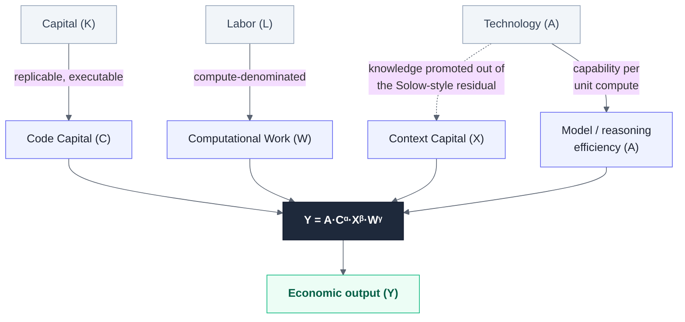
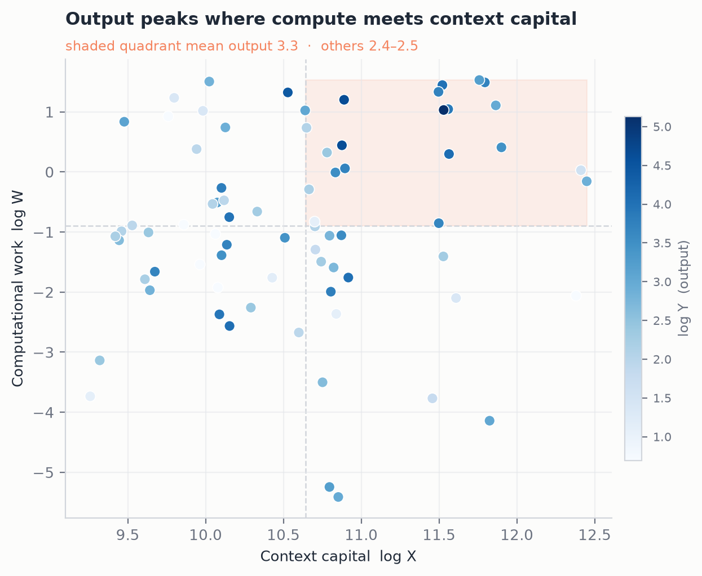
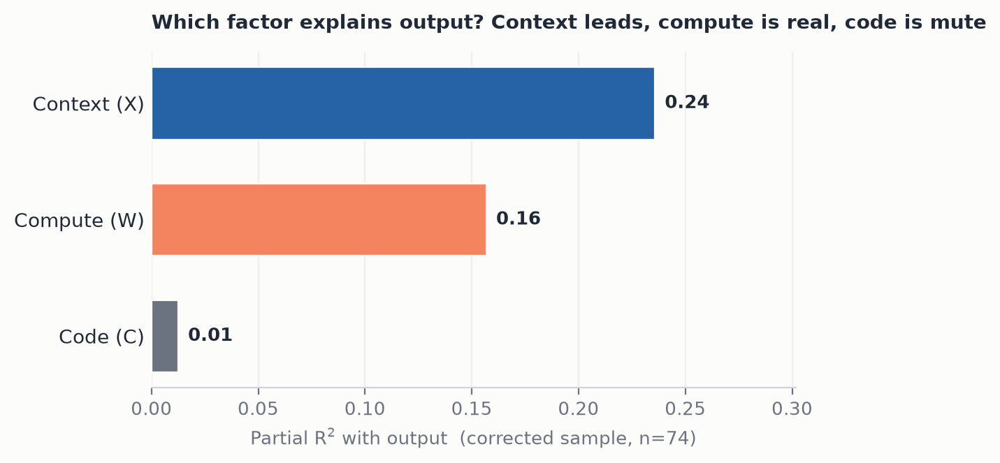
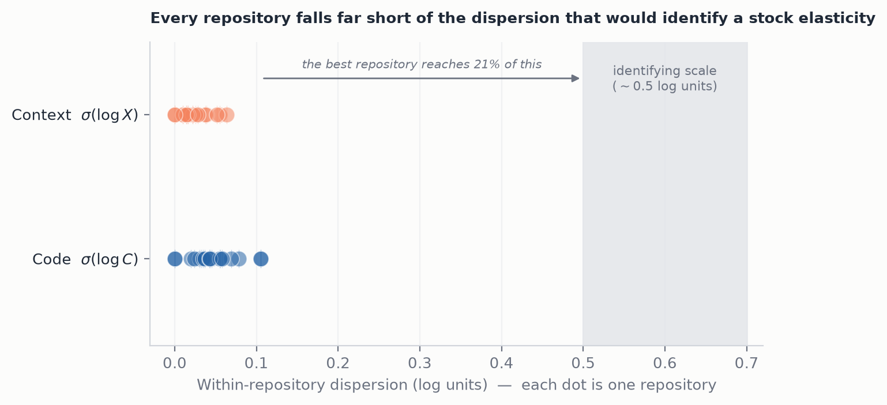
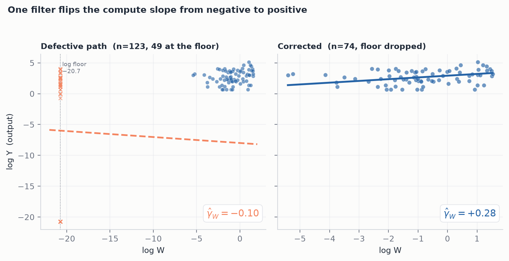

# The AI Production Function


> Subtitle: *Code Capital, Context Capital, and Computational Labor*


**Keywords:** production function; artificial intelligence; agentic economy; intangible capital; endogenous growth; computational labor; productivity measurement

**JEL classification:** D24; O33; O47; E22; L86

## Abstract

Industrial economics models production as the interaction of physical capital and human labor, mediated by an exogenous technology term. This description fits AI-native production poorly. In such systems autonomous agents perform computational work by orchestrating reusable software and accumulated knowledge rather than by selling human time: the unit of labor is a compute token rather than a work-hour, and the assets that most raise output are code and context, which accumulate rather than depreciate in the ordinary sense.

This paper proposes a generalized production *framework* for AI economies: a conceptual re-grounding and a falsifiable research program, not yet an empirically validated theory. We introduce three economic primitives — **Code Capital (C)**, **Context Capital (X)**, and **Computational Work (W)** — and derive the production function $Y = A \cdot C^{\alpha} \cdot X^{\beta} \cdot W^{\gamma}$. Each primitive is connected to its lineage in neoclassical growth theory (Solow, 1956, 1957), endogenous growth theory (Romer, 1986, 1990), intangible-capital accounting (Corrado, Hulten & Sichel, 2005, 2009; Nakamura, 2010; Haskel & Westlake, 2018), and the economics of distributed knowledge (Hayek, 1945). We specify capital-accumulation dynamics, state how each factor can be operationalized, confront the simultaneity problem that governs identification of the elasticities, weigh the labor interpretation of compute against capital-service and intermediate-input alternatives, and derive falsifiable hypotheses. The contribution is a re-grounding of the production function for agentic economies, not a theory of token pricing; future work builds on this foundation.

**Scope.** This model holds capital in its classical role as a *means* of production. A future extension that relaxes this assumption would rest on the Code / Context / Computational-Work foundation established here.

## 1. Introduction

The production function is one of the most durable constructs in economics. From Cobb and Douglas (1928) through Solow (1956), the field has modeled aggregate output $Y$ as a function of capital $K$, labor $L$, and an efficiency term $A$, the last long treated as an exogenous residual. Since Wicksteed (1894) formalized the apparatus, the framework has organized more than a century of industrial experience, in which humans operated physical and, later, digital machines, with few moving parts.

AI-native production strains this framework in three ways. Labor is no longer human: an agent that drafts, reviews, and ships a pull request performs productive work, yet consumes no human work-hour in the act. The producer is a system, not a person operating a tool: the decisions of what to retrieve, which tool to call, and when to verify have migrated into the software. And code and context accumulate rather than deplete as physical capital does; a maintained library and a curated record of past failures both raise tomorrow's output, often at near-zero marginal cost.

Any one of these shifts could be absorbed by recalibrating a parameter. Together they suggest that the primitives need redefinition. This paper takes the conservative step: it keeps the functional form and the role of capital as a means of production, and re-labels and re-grounds the factors so that an AI economy can be described without forcing its phenomena into ill-fitting categories. A more aggressive extension is deferred to future work.

The paper's genre should be fixed at the outset: this is a theory-and-measurement-framework paper with a preliminary, single-organization illustrative case study (Section 9); no empirical claim in it carries external validity, and the reader who wants estimates rather than estimability should treat Section 9 as a demonstration that the framework can be taken to data, not as evidence for it.

**Notation.** Throughout this paper, $(\alpha, \beta, \gamma)$ denote the output elasticities of $C$, $X$, and $W$.

The paper proceeds as follows. Section 2 maps the intellectual lineage and separates what is known from what is new. Section 3 diagnoses where the classical function breaks. Section 4 defines the three primitives. Section 5 derives the generalized production function. Section 6 specifies capital accumulation. Section 7 sets out operationalization and the identification strategy. Section 8 gives a simulation skeleton. Section 9 reports a preliminary empirical illustration on one AI-native organization's own production records. Section 10 draws implications. Sections 11–13 state hypotheses, limitations, and conclusions.

## 2. Related Work

This paper's claim to novelty is deliberately narrow. As the related-work survey below sets out, none of the three primitives is without precedent; the contribution is their integration into one production function. This section separates lineage from gap.

### 2.1 Classical and growth economics

The production-function tradition begins with Cobb and Douglas (1928), whose empirical fit of $Y = A K^{\alpha} L^{\beta}$ to U.S. manufacturing data fixed the form that later theory rationalized. Solow (1956) embedded a general neoclassical production function in a growth model — Cobb-Douglas being the leading special case — and, in 1957, showed that the larger part of measured growth in U.S. non-farm output over 1909–1949 could not be explained by capital and labor; the unexplained residual was attributed to technical change. In this paper the residual $A$ is reinterpreted as **model and reasoning efficiency**: the capability per unit of compute that a frontier model delivers. Where Solow's residual was a pure macroeconomic unknown, the model-capability component of $A$ in an AI system admits *observable proxies*: benchmark scores, pass-rates, tokens-to-success. $A$ nonetheless remains a residual in estimation, and these proxies are lower bounds on its capability component, not $A$ itself; organizational, allocative, and utilization content still resides in $A$ unless separately measured (Section 7.1). It is because the firm-level productivity term $A$ is *not* fully observed that the identification problem of Section 7.2 arises; the claim here is only that AI makes $A$ *more* proxyable than in Solow's setting, not that it dissolves the residual. This is the same programme Jorgenson and Griliches (1967) set in motion: their response to the residual was to argue that it shrinks as inputs are measured more accurately — that much of "technical change" is mismeasurement of capital and labor quality. Reading $C$, $X$, and $W$ as inputs previously absorbed into $A$ places this paper squarely in that tradition rather than in opposition to it, and it inherits the corresponding warning: an input series that is constructed rather than observed can move the residual without explaining it, which is exactly the failure Section 9 documents in its own measurements.

Two recent contributions bear directly on the exercise. Aghion, Jones and Jones (2019) model AI as automation of the production of goods *and* of ideas, and derive the conditions under which it raises growth rates rather than levels; their central caution — that growth ends up limited by whatever sector resists automation, in the sense of Baumol (1967) — is the natural macro counterpart to the question posed here at the firm level. Jones and Tonetti (2020) show that data is non-rival and that who owns it determines whether it is used efficiently, which is the property that makes $X$ economically distinctive rather than merely another intangible line item. The framework below is the firm-level, measurable complement to both: where they characterize the aggregate consequences, this paper asks what has to be counted inside a single producing unit for those consequences to be testable.

Romer (1986, 1990) made knowledge endogenous: an accumulable, partially non-rival input whose marginal product need not diminish. Romer's knowledge capital is the closest ancestor of **Context Capital**: both treat accumulated know-how as a stock that raises future output and that markets under-provide. The difference is not that endogenous growth left knowledge inert inside $A$ — in Romer (1990) the technology index has its own equation of motion, driven by researchers and the existing stock, and giving $A$ that law of motion *is* the contribution. The difference is the level of aggregation and the observability that follows from it. Romer's $A$ is an economy-wide index identified from aggregate research inputs; $X$ here is a firm- and even repository-level stock accumulated from specific, dated, machine-readable artifacts, so it can be measured, depreciated, and priced at the unit where the production decision is actually made. What is promoted is not knowledge-as-such but knowledge at a grain where it has an owner and a balance sheet.

Smith (1776) supplies the social-theoretic base: the division of labor raises productivity by specializing tasks. In an AI economy the division of labor becomes a division of *computational* labor across specialized agents, but the principle is unchanged.

### 2.2 Intangible and knowledge capital

The claim that code is capital is not new. Corrado, Hulten and Sichel (2005, 2009) established the modern framework for measuring intangible investment (computerized information, innovative property, and economic competencies) and showed that intangibles account for much of the post-1995 productivity acceleration; Haskel and Westlake (2018) trace the broader shift to an intangible-intensive economy. Nakamura (2003, 2010) estimated the U.S. intangible-asset stock in the trillions of dollars. The last time economics added a computing factor to the production function and measured its contribution — the ICT growth-accounting literature of Jorgenson and Stiroh (2000) and Oliner and Sichel (2000) — is a direct methodological precedent for the exercise here, and Brynjolfsson and Hitt (2000) showed that the productive complement of that computing capital was unmeasured organizational capital, the closest existing empirical analogue of what $X$ names. Accounting standards followed in part: under U.S. GAAP (ASC 350-40 for internal-use software, ASC 985-20 for software to be sold) and IFRS (IAS 38), some internally developed software is capitalized rather than expensed.

**Code Capital (C)** belongs to this lineage, and we should be exact about how little of it is new. Own-account software is already a capitalized asset in the CHS "computerized information" category and in the national accounts under SNA 2008; it already carries a perpetual-inventory accumulation equation, an asset-specific depreciation rate, and a share-weighted contribution to output. On its own, then, $C$ is a relabeling of an existing category. What is not already there is the *separation*: standard accounts hold software in one intangible category alongside databases and organizational capital, whereas this framework splits that category by mode of consumption (above) and asks whether the split justifies its cost in a production function. The contribution attaches to the partition and to the factor that occupies the labor slot, not to $C$ considered alone.

Hayek (1945) bears on the companion factor, but as a tension to be confronted rather than a warrant to be claimed. Hayek's thesis is that the economically relevant knowledge — "knowledge of the particular circumstances of time and place" — is dispersed, often tacit, and *cannot* be gathered into any single mind or plan; that is his argument against central planning, not a licence to codify. Writing such knowledge into a retrieval corpus is therefore closer to the operation Hayek said would fail than to one he endorsed. The defensible statement is a conditional empirical claim: to the extent that agent context is codifiable — postmortems, verified corpora, tuned prompts — the Hayekian objection weakens for that portion and $X$ measures it; to the extent that it is not, $X$ captures only the codified residue and systematically understates the knowledge actually at work. Which portion dominates is an empirical question this framework makes askable, and a finding that $X$ has little explanatory power would be evidence for Hayek's side of it, not against the measurement. The tacit/codified boundary itself is Polanyi's (1966): what can enter $X$ is exactly what survives codification.

### 2.3 Task-based automation and the non-rivalry of data

Two literatures sit closest to this paper's two most contestable moves and must be engaged directly. The first is the **task-based theory of automation**. Zeira (1998) showed that automation replaces labor task by task and tends to lower the labor share; Acemoglu and Restrepo (2018, 2019) formalized this as a *displacement* of labor from tasks by capital, offset by *productivity* and *reinstatement* effects, with a task-allocation microfoundation, and their 2022 paper takes the framework to data, showing that task displacement accounts for a large share of the rise in U.S. wage inequality across demographic groups — evidence that the task margin on which the reduced-form reading of $W$ relies is quantitatively first-order, not a modeling convenience (Acemoglu & Restrepo, 2022). This is the framework that already models the substitution our Computational Work $W$ performs ("capital performs the task" becomes "computational work performs the task"), and our labor-slot claim for $W$ (Section 5.3) is best read as a reduced form of their task margin rather than as a fresh assertion. The second is the **non-rivalry of data**. Jones and Tonetti (2020) give the canonical treatment of data as a non-rival stock whose optimal use and ownership differ from rival capital; Farboodi and Veldkamp (2021) supply the closest dynamic treatment, a growth model in which data accumulates as a by-product of economic activity and depreciates as the environment drifts — precisely the two channels Section 6.2 writes into $X$'s law of motion. Context Capital $X$ is an instance of this object, and the accumulation dynamics of Section 6.2 inherit their non-rivalry logic; the task-level exposure measurements of Eloundou et al. (2024) are the natural empirical bridge for the task margin on which the reduced-form reading of $W$ relies. We situate $X$ against Jones-Tonetti rather than reinventing the non-rivalry argument. On the growth side, the increasing-returns intuition of Section 5.4 must also be read against Jones (1995), whose semi-endogenous correction removes the scale effects that naive increasing returns would imply, and against Aghion and Howitt (1992), whose Schumpeterian creative destruction is the natural reading of the accelerated code depreciation $\delta_c$ in Section 6.1.

### 2.4 AI and compute economics

A younger literature studies compute as an economic resource in its own right, distinct from pricing. Kaplan et al. (2020) established the neural scaling laws, showing that model loss falls as a power law in parameters, data, and compute, a functional relationship between inputs and capability that reads like a production function for intelligence. Hoffmann et al. (2022) refined this into compute-optimal allocation, showing model size and training tokens should scale in proportion; the implication is that compute has a measurable marginal product that depends on how it is split across factors, not merely on its total. Thompson, Greenewald, Lee and Manso (2020) treat compute explicitly as a scarce economic input and argue that the field is approaching economic and environmental limits on the compute that can be deployed, framing the question of *what compute produces* rather than *what it costs*. A separate strand takes the production side as given and asks how to *price* compute and tokens as goods: Zhu, Q. (2026) develops the token as the accounting unit of foundation-model services, drawing the analogy to kilowatt-hours in electricity markets, and Litowitz, Polson and Sokolov (2026) develop a cognate photon-token accounting. That strand supplies the metering and pricing apparatus future work builds on when it argues the token is the accounting unit of a *labor-slot factor* rather than of a priced intermediate input.

A distinct 2026 literature, appearing after this framework was first drafted, introduces an AI-specific capital or labor factor directly, and it bears on this paper's most contestable moves. Zhu, S. (2026) argues that agents are *not* labor but a capital-to-labor conversion technology, and derives a compute-anchored wage in which cognitive labor is priced in the compute-capital market rather than the labor market — the named counter-position to the labor-slot claim of Section 5.3. Zhang and Zhang (2026) define Digital Intelligence Capital as a distinct asset class with *endogenous*, competition-driven depreciation and a data-flywheel accumulation law, formalizing at the model-provider layer dynamics that Section 6 treats informally at the firm layer. Farach (2026) introduces *agent capital* as a distinct, non-reducible factor; on our reading, its motivation lies in scalability and non-rivalry grounds close to Section 3's, deployed to model coordination cost rather than a production input with its own accumulation. Gardiner (2026) offers a five-form knowledge-theory-of-capital taxonomy — embodied, disembodied, institutionalized, commons, and public knowledge — that partitions the same territory by embodiment and governance rather than, as here, by mode of consumption. Chen et al. (2026) analyze tokens as economic primitives for agent systems, adjacent to the measurement of $W$. What none of these does is integrate several such factors into one production function; Section 2.5 states the gap precisely, and Sections 5.3 and 6.1 engage the two papers that touch the labor-slot and depreciation claims head-on.

This paper asks the prior question that none of these strands settles: what do AI systems produce *with*, and how does that restructure the factors of production? The scaling and compute-economics work documents that compute matters and that its marginal product is non-trivial, but treats model, data, and compute as engineering quantities rather than as capital and labor in a growth-accounting sense. Re-grounding them as economic factors (so their accumulation, depreciation, and elasticities can be compared with physical capital and human labor) is the contribution; pricing follows from that question and is left to future work.

### 2.5 The integration gap

The primitives have largely been developed in isolation, and the 2026 frameworks above each introduce a *single* AI-specific factor. The specific novelty this paper claims is deliberately narrow: it is, to our knowledge, the first to propose a **consumption-mode partition of intangible capital inside a production function** — executed ($C$) versus retrieved ($X$) — with compute in the labor slot and per-factor accumulation, *and to attach a pre-committed empirical test of whether that partition earns its keep* (H4). We do not claim that assembling three known components is itself a theoretical contribution; a conjunction of features can always be scoped so that only one paper satisfies it. The claim is rather that the partition is the right cut for a production function *if and only if* it predicts distinct accumulation dynamics and distinct elasticities — Section 6 states the asymmetric depreciation channels that give the prediction content, and H4 is the test — which a partition by residence or asset type (Gardiner, 2026) does not by itself deliver. The question this answers — whether AI's autonomous cognitive capability should be treated as a distinct factor of production — was put on the table by Farach, Cambon and Spataro (2025); this paper's answer is affirmative and operational, giving the factor a measure ($W$), an accumulation-bearing capital split ($C$ and $X$), and estimable elasticities rather than a single conceptual factor. The method itself is the standard one — add a stock to Cobb-Douglas and estimate its elasticity, the template of Mankiw, Romer and Weil (1992) — applied to a new partition of the intangible stock.

The comparison below places the contribution against the nearest traditions.

| Approach | Code | Context | Compute | Accumulation | Empirical design |
| --- | --- | --- | --- | --- | --- |
| Classical Cobb-Douglas | folded into general capital | absent | absent | physical capital | established |
| Intangible-capital accounting | partial | partial | limited | intangible stock | partial |
| AI-automation literature | automation capital | limited | partial | limited | varied |
| This paper | separate factor | separate factor | labor-like factor | explicit, per factor | proposed |

No row is empty in every column; the last is distinguished by treating all three as first-class factors at once, each with its own accumulation dynamics and elasticity.

## 3. Why the Classical Production Function Fails for AI

The classical function does not fail everywhere. Three specific mismatches recur.

1. *The labor slot is empty.* In $Y = A K^{\alpha} L^{\beta}$, $L$ is measured in human hours. When an agent runs unattended over a weekend and ships a feature, attributing the output to a human work-hour is a fiction, and attributing it to zero labor is worse. The function needs a factor that plays labor's role (the effort applied to capital to produce output) but is measured in compute.

2. *The most strategic asset is unmeasured.* A firm's curated agent memory (incident postmortems, verified retrieval corpora, tuned prompts) raises output, yet appears on no conventional balance sheet except, at best, as an undifferentiated intangible. The function needs a factor for accumulated, learning knowledge.

3. *Code behaves like capital but accumulates unusually.* Software investment compounds (one library serves ten services) and also decays (dependency rot, schema drift). Standard capital accounting captures the depreciation but not the non-rival replication that makes code's marginal product so high. The function needs a capital factor that can be replicated at near-zero cost.

These mismatches indict the *labels* of the classical function, not its algebraic form. The repair is therefore conservative: keep the multiplicative, constant-elasticity structure that has served growth theory for a century, and redefine the factors.

## 4. Redefining Production Factors

| Classical (Industrial) | AI Economy                | Meaning                                              |
| ---------------------- | ------------------------- | ---------------------------------------------------- |
| Capital (physical)     | **Code Capital (C)**      | Reusable, executable, replicable capital             |
| Knowledge (in $A$)     | **Context Capital (X)**   | Accumulated, learning knowledge capital              |
| Labor (human hours)    | **Computational Labor**   | Compute-denominated labor; its measure is *computational work* ($W$) |
| Technology ($A$)       | Model · Reasoning efficiency | Capability per unit of compute                     |

The central move is to place **computational labor** in the labor slot. We name the factor *computational labor* (the effort that occupies that slot) and denote its compute-denominated measure *computational work* $W$, the flow of tokens, FLOPs, energy, and latency, exactly as human labor is measured in work-hours. The rest follows: code occupies the capital slot, now replicable rather than physical, and the knowledge that growth theory buried inside $A$ is promoted to its own factor $X$.

$W$ is a composite, not a single meter. Write $W = f(T, F, E, L, Q)$ over tokens $T$, floating-point operations $F$, energy $E$, latency $L$, and quality $Q$. The five are not independent: $T$, $F$, and $E$ are near-proportional within a fixed model-and-hardware regime, so in practice the index reduces to three axes — a *volume* axis (any of $T$, $F$, $E$), a *speed* axis ($L$), and a *quality* axis ($Q$) — of which volume is the one routinely instrumented. Four accounting conventions must be fixed before any $W$ series is comparable, and we state them rather than leave them implicit. *Model heterogeneity:* tokens from models of different capability are non-commensurable units; a multi-model $W$ series requires quality-weighting by model (a price- or FLOP-deflator), or restriction to a single model regime — the compute analogue of the labor-quality adjustment of Jorgenson and Griliches (1967). *Prefill versus output:* agentic workloads are prefill-dominated and cache-dependent, so output tokens alone understate — and prompt caching decouples — the FLOPs actually spent; the near-proportionality above holds only within a fixed serving regime (hardware, batching, caching, decoding strategy), which a multi-week multi-provider panel will generally not satisfy. *Failed effort:* retries and abandoned trajectories count toward $W$, exactly as human work-hours include failed effort; excluding them would make $W$ an output measure rather than an input measure. *Quality:* token counts measure how much computational labor was performed, not how well, and a $W$ that omits $Q$ will overstate the productivity of a verbose or failing agent. The empirical work below uses output tokens for volume and states the absence of $Q$, $L$, and the model-heterogeneity adjustment as limitations rather than assuming them away. Future work develops the index and its pricing; the definition is given here because $W$, not the capital split, is where this framework departs furthest from existing accounts.

**The partition principle.** Code and context overlap in practice — a repository carries design rationale, a retrieval corpus carries executable snippets — so the split needs a rule, and the rule is the framework's actual taxonomic claim. An artifact enters $C$ if it is **executed** and $X$ if it is **retrieved for its content**; an artifact doing both is apportioned rather than counted twice. This partitions by *mode of consumption*, which cuts across the standard intangible-asset taxonomy: the same repository can contribute to both stocks, and two assets that national accounts would place in one category (own-account software) land in different factors here if one is run and the other is read. That is the substantive difference from an asset-type classification, and it is what makes the $C/X$ split an empirical question (Section 7.2) rather than a relabeling. Two difficulties of the apportionment rule must be conceded at the definition, not discovered later. Execution events and retrieval events have no common natural denominator, so the apportionment share is unit-dependent until a normalization (per-invocation compute, or per-event value weights) is fixed; and because the shares are computed from usage events inside the accounting window, the stocks are partly *endogenous to the production process they are meant to explain* — a hot-path library invoked millions of times would be classified almost entirely into $C$ by event count regardless of how often agents read it. A workable rule must therefore fix the normalization ex ante and measure consumption shares on a window preceding the output window. The pilot of Section 9 does not implement event-level apportionment at all; it proxies the partition by file type, a limitation stated there.

Figure 1 summarizes the remapping.



*Figure 1. Remapping of the classical factors (K, L, A) to the AI-native factors (C, X, W, A) and their entry into the generalized production function.*

## 5. The Generalized Production Function

### 5.1 Definition

We propose the generalized AI production function:

$$Y = A \cdot C^{\alpha} \cdot X^{\beta} \cdot W^{\gamma}$$

| Symbol | Meaning                          |
| ------ | -------------------------------- |
| $C$    | Code Capital                     |
| $X$    | Context Capital                  |
| $W$    | Computational Work — the compute measure of computational labor |
| $A$    | Model · reasoning efficiency     |
| $Y$    | Economic output                  |
| $\alpha, \beta, \gamma$ | Factor elasticities (output elasticity) |

### 5.2 Why keep the Cobb-Douglas form

We retain the multiplicative, constant-elasticity form for three reasons, and we state plainly what the form does and does not encode. First, it is the standard form in growth accounting, which lets the framework inherit a century of estimation machinery (Solow, 1957; Jorgenson, 1963); the empirical template is that of Mankiw, Romer and Weil (1992), who added a stock to Cobb-Douglas and estimated its elasticity. Second, it is the tractable boundary case: the first-order approximation in logs to any smooth technology, and the $\sigma \to 1$ limit of the CES family. What it encodes is *essentiality with unit elasticity of substitution* — zero code, zero context, or zero compute yields zero output, and a one-percent shortfall in any factor is repaired by a fixed percentage of any other. We claim no more than that. Essentiality alone does not select Cobb-Douglas: it is shared by every CES technology with $\sigma \le 1$, so it selects the family, not the member — and the operational intuition that "no amount of context substitutes for the absence of executable code" is in fact an argument for $\sigma < 1$, i.e. for *stronger* complementarity than Cobb-Douglas admits. The form is chosen as a deliberate first-order approximation, held as a prior that the data can reject: estimating a CES $\sigma$ significantly below one would reject the form chosen here without touching the factor definitions, and Section 12 records this as a live limitation rather than a settled matter. Third, the form reduces to the classical case: setting $C \to K$, $X \to 1$, and $W \to L$ recovers Cobb-Douglas, so the theory nests its predecessor rather than contradicting it.

One structural limit of the choice must be conceded up front. Fixed exponents impose fixed factor shares, so this form cannot generate the displacement dynamics — a task margin moving between labor and capital, shifting factor shares as it moves — that Section 2 credits to Acemoglu and Restrepo and of which the labor-slot claim for $W$ is a reduced form. Within this paper the exponents are estimands over windows short enough to hold the task allocation fixed; modeling the movement of that allocation requires the task-based machinery itself, not a re-parameterized Cobb-Douglas.

The form is not meant to be realistic. It is the most conservative choice that keeps the framework comparable to existing growth accounting, and departures from it are objects of estimation, not assumption.

### 5.3 Substituting $W$ for $L$

The substitution is substantive. Human labor $L$ is constrained by population, hours, and skill; it is rival and rented. Computational Work $W$ is constrained by compute supply, energy, and latency; it is rival at the hardware level but infinitely divisible and globally allocatable. Treating $W$ as labor makes the production frontier a function of compute rather than headcount, and reframes the firm's planning question from "how many people do we need?" to "how do we allocate compute across code investment, context investment, and direct work?"

The placement of $W$ in the labor slot is a claim, not a definition, and it competes with three alternatives. Compute can be read as *capital utilization*, the flow of services from the accelerator stock, as machine-hours are for physical capital (Jorgenson, 1963); as an *intermediate input* consumed in production, like electricity; or as *energy* proper. The last two readings have a direct precedent in the KLEM tradition, which separates energy from capital and labor as its own factor so that substitution and complementarity among capital, labor, energy, and materials can be estimated (Berndt & Wood, 1975). Each reading is coherent, and intuition does not settle the choice. The capital-service reading is not merely hypothetical: Zhu, S. (2026) formalizes it, modeling agents as a capital-to-labor conversion technology and deriving a compute-anchored wage set in the compute-capital market rather than the labor market. That is the sharpest form of the objection — but Zhu's claim concerns factor *pricing* (what sets the wage) while the claim here concerns factor *accounting* (which slot output is attributed to), so the two are not strictly incompatible, and where they do diverge the difference is empirically decidable by the same condition H3 states below. What favors the labor reading is that compute, unlike a passive capital service or a consumed material, is the factor that performs the tasks once assigned (it reasons, retrieves, calls tools, and verifies), so the firm's operative substitution is compute-for-headcount, not compute-for-materials. The distinction is empirical, and we state it as a falsifiable condition together with the instrumentation it requires, because a test condition that cannot be instrumented is not a test. The labor interpretation is retained only if, at the task level, marginal compute predicts autonomous task completion after controlling for the code and context stocks *and for an independently measured capability stock* — the model version served, its context window, its tool affordances — since without that control the labor and capital-service readings are observationally equivalent (a panel lacking it, like the pilot of Section 9, cannot test H3 at all). A second observable separates the readings on the payment side: under the labor reading the $\gamma Y$ share is the compensation of a factor the firm supplies internally, while under the capital-service reading it is a purchased-services outlay to the compute owner, so factor-payment and ownership data discriminate where output data alone do not. Within the Cobb-Douglas algebra the slot assignment carries no content — the function is symmetric in its arguments — so the labor-slot claim is entirely a claim about measurement, accounting, and substitution behavior, not about the functional form. Future work must build the accounting of $W$ that would decide this; here $W$ enters only as a factor whose slot is argued rather than assumed.

### 5.4 Returns to scale and the non-rivalry of accumulable factors

Under constant returns to scale, $\alpha + \beta + \gamma = 1$. We treat this as a hypothesis to be tested, not an assumption, and there is a structural reason to expect departures from it. Code and, in part, context are non-rival: a library or a verified retrieval corpus can serve many services at once without being depleted (Romer, 1990). Two distinct objects must be kept apart here, because conflating them is a common error. The *homogeneity of the production function* in $(C, X, W)$ is exactly $s = \alpha+\beta+\gamma$ by Theorem A.3, and this degree is **invariant to non-rivalry**: non-rivalry does not change the exponents. The increasing-returns claim is instead about the *replication technology*, and it requires a different scaling experiment: replicate the rival inputs (compute $W$, and the deployment count) while *reusing* rather than rebuilding the non-rival stock. Under that experiment, serving $n$ deployments from one non-rival code or context stock yields output proportional to $n$ at the cost of the rival factors alone, so per-unit output rises with scale (formalized in Appendix B, Proposition A.4(ii)). The framework therefore anticipates increasing returns *in deployment of the non-rival factors* (a property of how the stock is replicated across uses, not of the function's degree of homogeneity), with the magnitude an empirical question. Increasing returns to accumulated capital are a necessary condition for winner-take-most outcomes but not a sufficient one: concentration also requires excludability or a distribution advantage, and it can be blunted by open-source substitutes, multi-homing, model-switching, and compute-supply constraints. Whether these forces net out to concentration in foundation-model markets is a question this framework poses rather than settles; Zhang and Zhang (2026) settle a version of it upstream, deriving a data-flywheel bifurcation above which symmetric provider competition tips to winner-take-all — complementary to the firm-level question here, and the kind of threshold analysis a full answer requires. Our simulation (Section 8) initializes $\alpha = \beta = 0.35$, $\gamma = 0.30$: the two capital exponents are set equal so that any $C$/$X$ asymmetry the data show is discovered rather than assumed, and $\gamma$ is set slightly lower on the prior that, without good code and context, added compute yields diminishing returns — a near-symmetric baseline, not a neutral one, and one the data can move.

## 6. Capital Accumulation Dynamics

Both capital factors follow perpetual-inventory logic (Goldsmith, 1951; as used throughout the capital-measurement literature since Jorgenson, 1963), but the partition of Section 4 is only worth making if the two stocks obey *different* laws, so this section states not just the shared accumulation form but the asymmetries the consumption-mode split predicts: the two depreciation rates are driven by different processes ($\delta_c$ by the executed substrate, $\delta_x$ by the retrieved distribution), and the context stock faces a congestion channel that the code stock does not. These asymmetries are what H1, H2, and H4 test; without them the split would be decorative.

### 6.1 Code Capital

$$C_{t+1} = (1 - \delta_c) \cdot C_t + I_c$$

Code depreciates at rate $\delta_c$ and is replenished by investment $I_c$ in new modules, refactors, and migrations. Because code is *executed*, its decay is driven by the execution substrate: dependency breakage, platform and model API churn, schema drift — events on the release calendar of the systems the code runs on, largely exogenous to the firm's own task mix. This is the first asymmetry the partition predicts: $\delta_c$ should co-move with substrate release cycles, not with the firm's demand distribution, and disciplined estimates can borrow from the R&D- and software-depreciation literature (Li & Hall, 2020) rather than being asserted. Two features distinguish code from physical capital. **Replicability:** a single library can be invoked by arbitrarily many services at near-zero marginal cost — an internalized scale economy for its owner, and a Romer-style wedge between social and private marginal product only where the code is used beyond the owner's pricing reach, open source being the systematic case (Proposition A.4(ii)). **Accelerated decay:** because code depends on a fast-moving substrate (models, libraries, platforms), $\delta_c$ is plausibly higher than for physical capital, raising the steady-state investment required merely to hold $C$ constant. This is *maintenance* depreciation — the physical decay of an owned code stock. It is distinct from the *competitive* obsolescence that Zhang and Zhang (2026) micro-found for AI capability stocks, in which a rival's innovation raises one's effective depreciation rate (a Red-Queen effect) independently of any physical decay; the two channels are additive, and only the maintenance channel is modeled here.

### 6.2 Context Capital

$$X_{t+1} = X_t + \eta \cdot D_t - \delta_x \cdot X_t$$

Context accumulates through learning — in the spirit of, though not identical to, Arrow's (1962) learning-by-doing, whose knowledge is embodied in cumulative gross investment rather than held as a freestanding retrievable stock; the freestanding-stock reading here is an extension, closest formally to the data stock of Farboodi and Veldkamp (2021) — at efficiency $\eta$ applied to new experience or data $D_t$, and decays at rate $\delta_x$. Because context is *retrieved*, its decay is driven by the retrieved distribution, not the execution substrate: stored knowledge stales as the task and query distribution drifts away from the conditions under which it was written. This is the second asymmetry the partition predicts — $\delta_x$ should co-move with the firm's task-mix drift while $\delta_c$ co-moves with substrate churn, so the two rates are driven by observably different covariates, and the split is empirically vacuous only if both respond to the same process.

One channel is specific to $X$ and must be stated because the linear law above cannot express it: **retrieval congestion**. As an unweeded corpus grows, retrieval precision falls and distractor passages can actively degrade task performance, so the marginal product of *stored* context can turn negative even while the marginal product of *effective* context remains positive. Write effective context as $\tilde X = X \cdot p(X)$, with retrieval precision $p(\cdot)$ non-increasing in uncurated volume and maintained near one by curation. The production function of Section 5 takes $\tilde X$ as its argument; Theorem A.1's positive marginal product is a statement about $\tilde X$, and it holds for raw $X$ only under the maintained assumption that curation keeps $p$ approximately constant — an assumption H2 partially tests, since a corpus accumulated without curation should show the congestion signature (rising $X$, flat or falling output). No corresponding channel exists for $C$: an unused library does not degrade the libraries that are used. In an agent economy, then, context behaves as a **living, learning stock** — experience becomes memory, memory becomes context, context makes a better agent, and a better agent generates more valuable experience — but the loop runs through curation, not through raw accumulation.

Modeling context as capital rather than as depreciating data has three consequences. It makes the marginal product of *curation* (selecting, verifying, organizing experience) directly measurable. It implies a natural depreciation charge $\delta_x X_t$ against output, comparable to depreciation of physical assets. And it predicts that firms investing in persistent, well-maintained agent memory should exhibit compounding productivity, a testable claim.

## 7. Operationalization and Identification

A production function that cannot be taken to data is a metaphor. This section states how each factor could be measured and confronts the obstacle to estimating the elasticities: the simultaneity between factor choice and output that has shaped production-function econometrics since Marschak and Andrews (1944).

### 7.1 Measuring the factors

**Output ($Y$).** The empirical counterpart of $Y$ is economic value, not code volume. For an agentic system it is the value added attributable to agent-performed work: revenue from completed work, or task throughput weighted by verified quality; counting lines of code or tokens emitted as output is ruled out. One accounting choice made here must be defended, because it is not the national-accounts default. Compute is typically *purchased* from an outside provider, and a purchased input is, in SNA terms, an intermediate — which would put the analysis in gross output with Domar aggregation (Hulten, 1978), the treatment the KLEM tradition gives energy (Berndt & Wood, 1975). We instead treat $W$ as a **rented primary input** — the analogue of leased capital services or temporary agency labor, factors that are also purchased at market rates yet conventionally kept inside the primary-factor boundary — so that $Y$ remains value added net of true intermediates (materials, hosting, third-party services) but gross of the compute bill, which is accounted as the factor payment $\gamma Y$ to computational labor. This is a declared convention, not a discovery: the gross-output alternative is coherent, the choice between them is exactly the labor-versus-intermediate question H3 poses (Section 5.3), and an H3 rejection would move $W$ to the intermediate side and the accounting to Domar weights with it.

**Computational Work ($W$).** $W$ is denominated in compute, not hours. Its observable components include inference tokens, FLOPs, tool calls, wall-clock execution time, and a verified-success rate. Full accounting is deferred to future work; here we flag one caveat that matters for measurement. Any scalar $W$ is a *normalization* of a multidimensional vector (tokens, FLOPs, energy, latency, quality), not a natural physical unit; the toy index in Section 8 combines these dimensions but has no dimensional interpretation and should be read as an ordinal proxy pending a fuller accounting.

**Code and Context Capital ($C$, $X$) as latent constructs.** Neither $C$ nor $X$ is a single number. Following the treatment of intangible and human capital in the growth literature (Corrado, Hulten & Sichel, 2009; Haskel & Westlake, 2018) — and inheriting the measurement problems of any knowledge stock, catalogued since Griliches (1979): what deflator, what depreciation, what aggregator — we model each as a latent stock inferred from observable indicators:

- $C$: reuse rate, test coverage, API stability, dependency freshness, maintenance cost, modularity.
- $X$: volume of verified knowledge, retrieval precision and recall, coverage of past-incident patterns, breadth of tool knowledge, staleness of stored context.

Two measurement routes are available and complementary. The first is a perpetual-inventory account: cumulate investment flows ($I_c$ for code, curation spending for context), deflated by an appropriate price, exactly as intangible-capital accounts cumulate intangible investment. The second is a reflective latent-variable model that treats the indicators as noisy manifestations of one underlying stock. The first prices the stock; the second tests whether the indicators move together as a single construct rather than several.

**Model efficiency ($A$).** The residual $A$ must be kept from reabsorbing the factors it was split from, or the framework merely reproduces the Solow residual under a new name. We confine $A$ to capability per unit of compute (the frontier model's benchmark performance and its tokens-to-success — the compute, in tokens, that a fixed task takes to complete, so that fewer tokens mean more capability) and exclude the things that load onto the other factors: curated knowledge belongs to $X$, reusable tooling to $C$, and output quality to the measurement of $W$. One entanglement in this assignment must be named: tokens-to-success measured on the firm's *own* tasks also falls when $C$ and $X$ improve (better tooling and better context both shorten trajectories), so an in-production proxy for $A$ loads on the very factors it was split from. The clean instrument is therefore capability measured on *fixed external benchmark tasks* that use none of the firm's code or context; the quality axis $Q$ stays inside $W$, and $A$ is identified from the fixed-harness measurement alone. Organizational and human-supervision capability, which classical accounting would bury in the residual, is not part of $A$ here; it enters through the code and context stocks a firm chooses to build, and any part that resists this attribution is a stated limitation rather than a silent catch-all.

**Boundary and double-counting.** Because code and context overlap in practice (a repository carries design rationale, a retrieval corpus carries executable snippets), each asset is counted once, by its *function*: an artifact enters $C$ if it is executed and $X$ if it is retrieved for its content, and an artifact that does both is apportioned by its share of execution versus content-retrieval events over the accounting window, not counted twice. The split is retained only if it pays for itself empirically; Section 7.2 states the test, and Section 4 states the normalization and endogeneity difficulties of the apportionment rule itself.

To show the same function reading across settings, the following instantiations fix each factor to an observable.

| Setting | $C$ (code) | $X$ (context) | $W$ (work) | $Y$ (output) |
| --- | --- | --- | --- | --- |
| AI-native software firm | reusable modules, tests | codebase, issue and incident history | inference FLOPs | quality-adjusted deployments |
| Customer-support agent | tool-chain, workflows | product docs, customer history | agent execution volume | resolved tickets |
| Drug-discovery system | analysis pipelines | assay and biological data | model inference and search | validated candidates |

The columns are not interchangeable across rows (a resolved ticket and a validated candidate are different goods), but within each row the factors are commensurable, which is what the function requires.

### 7.2 The identification problem

Estimating $\alpha, \beta, \gamma$ is not a matter of regressing $\log Y$ on $\log C$, $\log X$, $\log W$. Factor levels are chosen in anticipation of productivity: a firm that draws a favorable model-efficiency shock $A$ invests more in code and context and runs more compute, so the regressors correlate with the error term. This simultaneity biases ordinary least squares and has been the central identification problem in production-function estimation since Marschak and Andrews (1944); Griliches and Mairesse (1998) document how stubborn it has proved.

The applied literature offers a menu that transfers directly. Control-function estimators (Olley & Pakes, 1996; Levinsohn & Petrin, 2003) use investment or intermediate-input demand to proxy for the unobserved productivity shock, and Ackerberg, Caves and Frazer (2015) correct the collinearity that undermines their first stage. The AI setting supplies an unusually favorable data environment for these methods: agent execution logs record compute, tool calls, and outcomes at high frequency, while code and context investment are timestamped in version-control and retrieval systems. The endogeneity does not disappear, and data richness does not by itself deliver identification: the identifying work is done by the control-function assumptions (a scalar, monotone productivity proxy), not by the data. What the AI setting improves is availability; the proxies and instruments that the classical literature had to construct laboriously are here logged by default.

One difficulty is specific to this framework, and we flag it rather than resolve it. Standard control-function estimators identify a single scalar unobservable, total factor productivity. Here $C$ and $X$ are themselves latent, inferred from indicators (Section 7.1), so estimation must combine the measurement of latent stocks with the simultaneity correction, a harder problem than the single-unobservable case, and an open one. We therefore state the empirical program, not a finished estimator. Given firm- or project-level panels that link (i) compute and outcome logs, (ii) code-investment histories, and (iii) the growth of curated memory, $\alpha, \beta, \gamma$ are identified under the control-function assumptions extended to the multi-factor case, and whether AI production exhibits constant, increasing, or decreasing returns (Section 5.4) becomes an estimable question rather than a stipulation. A synthetic Monte-Carlo check (the supplementary replication code, `estimation.py`) isolates the simultaneity bias on ground-truth elasticities $(\alpha,\beta,\gamma)=(0.35,0.35,0.30)$:

| Estimator | Recovered $(\alpha,\beta,\gamma)$ | Sum | Verdict |
| --- | --- | --- | --- |
| OLS, exogenous factors | $(0.34,\,0.35,\,0.29)$ | $0.99$ | recovers the truth |
| OLS, factors chosen on the shock | $(0.66,\,0.67,\,0.62)$ | $1.95$ | biased upward |
| Oracle control (shock observed) | $(0.35,\,0.35,\,0.30)$ | $1.00$ | bias removed once the shock is conditioned on |

This is method validation on synthetic data, not empirical evidence, and it establishes only the weaker of the two things a full demonstration would show. The first two rows are the substantive result: factor choice that loads on the unobserved productivity shock biases OLS upward, as theory predicts. One mechanism caveat, stated in the replication code and repeated here because a reader of the paper alone would otherwise be misled: the synthetic design models *selection on the shock* — cross-sectional factor choices loading on $\log A$ — which is one microfoundation of the endogeneity, not the Marschak-Andrews simultaneity mechanism itself; the two share the upward bias direction and the control-function remedy, and distinguishing them is not what this demonstration does. The third row is deliberately an *oracle* (it conditions on the true shock $\log A$, which the Monte Carlo generates but which no econometrician observes), so it shows that the bias is a confounding problem, not that any feasible estimator solves it. A working control-function estimator (Olley & Pakes, 1996; Levinsohn & Petrin, 2003) never observes $A$; it *proxies* the shock through a monotone investment or intermediate-input demand, and building that proxy for the multi-latent-factor case here is the open problem flagged above, not something this check discharges. The claim the table supports is therefore narrow: the simultaneity is real and vanishes when the confounder is conditioned on. It says nothing about the feasibility of the proxy or the true elasticities of any economy. One further limit of the demonstration should be stated plainly, because it is easy to over-read. In the synthetic design $C$, $X$, and $W$ are *observed* regressors, so the Monte-Carlo instantiates only the classical single-scalar-unobservable case; it does **not** simulate the harder difficulty this framework actually faces, that $C$ and $X$ are themselves latent, inferred from noisy indicators (Section 7.1), under which even a correctly specified control function is not guaranteed to recover the elasticities. The demonstration isolates the bias; it does not touch the multi-latent-factor problem, which remains open.

The split of intangible capital into $C$ and $X$ must also earn its place, and the test must respect the statistical relationship between the models being compared. The multiplicative pooled alternative $Y = A\,K^{\theta}W^{\gamma}$ with $K = C \cdot X$ is a *restricted nesting* of the split model — $(CX)^{\theta} = C^{\theta}X^{\theta}$ imposes $\alpha = \beta = \theta$ — so the correct comparison is the F (equivalently likelihood-ratio) test of $\alpha = \beta$, not a model-selection statistic for non-nested rivals: Vuong's (1989) normal statistic is inapplicable to strictly nested pairs. (An earlier decision rule in this project applied the non-nested Vuong statistic to exactly this pair; the error, found in audit, is corrected here and disclosed in Appendix C(vii), and the H4 rule now reads as follows.) The split is retained only if (i) the F test rejects $\alpha = \beta$, (ii) the split model out-predicts *both* pooled alternatives out of sample — the multiplicative form above and the additive aggregate $K = C + X$, which is how intangible accounts actually pool categories and which, being genuinely non-nested, is where a Vuong-type comparison does apply — and (iii) $\alpha$ and $\beta$ are separately identified rather than collinear. Both pooled alternatives are implemented in the replication package, not recorded as open specifications. One qualification survives the repaired test: collinearity of $\log C$ and $\log X$ is both the condition under which the split is uninformative and the condition under which pooling fits best, so a pooled win driven by collinearity supports "cannot distinguish on this data" rather than "the distinction is meaningless." Where $C$ and $X$ move together the pooled model is the honest one and the separation is a modeling cost with no return; the framework therefore treats the split as a hypothesis that this three-legged comparison can reject, not as a stipulation.

## 8. A Minimal Simulation Skeleton

To make the framework concrete and expose which parameters are load-bearing, we specify a minimal agent economy:

```python
class AgentEconomy:
    def __init__(self, delta_c=0.02, delta_x=0.04):
        self.code_capital = 1.0
        self.context_capital = 1.0
        self.model_efficiency = 1.0
        self.delta_c = delta_c
        self.delta_x = delta_x

    def computational_work(self, tokens, flops, energy, latency, quality):
        return tokens * quality * flops / (energy * latency)

    def produce(self, work):
        return (
            self.model_efficiency
            * self.code_capital ** 0.35
            * self.context_capital ** 0.35
            * work ** 0.30
        )

    def invest_code(self, amount):
        # one period of the accumulation law (Section 6.1)
        self.code_capital = (1 - self.delta_c) * self.code_capital + amount

    def invest_context(self, amount):
        self.context_capital = (1 - self.delta_x) * self.context_capital + amount
```

The skeleton is a toy, not a forecast: it exists to make hypotheses falsifiable. With it one can ask whether steady-state output is more sensitive to $\delta_c$ or $\delta_x$, or whether the returns-to-scale regime $(\alpha+\beta+\gamma)$ is identifiable from observable investment–output panels, the questions Section 7 poses to data. As noted in Section 7.1, the `computational_work` index is an ordinal proxy, not a dimensioned quantity. The toy index above is one admissible instance of the general normalization $W = f(T, F, E, L, Q)$ of Section 4 — the general $f$ is a family, not a formula, so the toy instantiates it rather than coinciding with it — and the toy in turn reduces to the $W = T \cdot Q / L$ used in Section 9 when tokens, FLOPs, and energy are near-proportional (a fixed model, hardware, and serving regime; Section 4), so that its $F/E$ ratio is a constant that drops out. One dimensional caveat: dividing by latency makes this index a throughput *rate*, where human labor input (work-hours) is a time *integral*; a cumulative variant (quality-adjusted tokens over the accounting window, with latency priced separately or absorbed into $A$) is the closer analogue of work-hours, and Section 9's window-aggregated token measure is of that cumulative kind.

## 9. Empirical Illustration (Preliminary)

The framework's operationalization (Section 7.1) has been implemented end-to-end on one AI-native software organization, the kind of single-firm instrumented setting Section 7 argues is the natural first testbed. **That organization is the author's own, and the records are the author's own version-control history and agent-session logs.** The author is therefore both the instrument-builder and the measured subject, which is disclosed here because it bears on every discretionary choice below; the mitigation is that the frozen panel (with repositories anonymized), the estimators, and self-contained regeneration scripts all travel with the reproducibility bundle, so each choice is inspectable rather than merely asserted. The design is a repository-week panel: units $i$ are the organization's repositories, periods $t$ are ISO weeks; 18 repositories, 123 repository-weeks (2026-W15..W30), 74 surviving the missing-observation filter. Three measurement choices deviate from the framework's own doctrine and are stated as such rather than papered over. *First*, investment flows are classified by **file type** (code and tests feed $I_c$; documentation and knowledge files feed $I_x$): this is an asset-type proxy for the consumption-mode partition, not the partition itself (Section 4), because the required execution- and retrieval-event logs were not collected in this window; testing the partition proper needs event-level apportionment, and nothing below tests it. *Second*, output is $Y = \text{commits} \cdot (1 - \text{revert rate})^2$ — the exact formula, disclosed here because an undisclosed exponent is a researcher degree of freedom — which is reliability-weighted task *throughput*, not the value added Section 7.1 calls for; commits are heterogeneous, endogenously splittable, and carry no price, so $Y$ here is a volume proxy of exactly the kind Section 7.1 warns against, tolerated only because no price signal exists inside a single organization. *Third*, computational work $W$ is inference output tokens alone: the quality and latency components of the $W = T \cdot Q / L$ index went unobserved in this source until collection began recording per-session outcome counters and durations on 2026-06-15, and the model-heterogeneity and prefill adjustments of Section 4 are likewise absent. Human labor $L_h$ is not separately identifiable (commits are agent-authored under the operator's identity, and the only human-effort signal, the session prompt count, is collinear with $W$), so the primary specification is compute-only; the shipped panel carries $L_h$ as an identically-zero column, recording the absence rather than hiding it. Estimation uses the within (repository fixed-effects) estimator, and each hypothesis carries an explicit decision rule fixed in a design memo before the run; that memo is an internal document rather than an external registration, so it constrains us but does not carry the guarantee a third-party registry would. The estimators are validated against synthetic panels with known elasticities before touching real data, and that validation suite now ships (Appendix A); the extraction layer that builds the panel from the organization's private records does not, so what travels is the frozen anonymized panel and the scripts that regenerate every number below from it.

The numbers below are the product of two disclosed correction rounds, summarized here once and documented in Appendix C. The first feasibility run was computed by a pipeline path that silently bypassed its own data-hygiene filter — 49 of 123 repository-weeks with no session coverage entered the regressions at the logarithmic floor and dominated the slopes — compounded by two estimator defects; all three were fixed and pinned by regression tests (Appendix C, items i–v). A second audit round then found four defects *in the correction itself*: the H4 model comparison applied a non-nested Vuong statistic to a strictly nested pair (Section 7.2); the "out-of-sample" cross-validation leaked future information through full-sample unit means; the naive $t$-statistics overstated degrees of freedom by ignoring the absorbed repository means; and the returns-to-scale bootstrap ignored the cluster structure. All four are fixed, the repaired machinery ships with pinned regression tests, and Table 1 reports only the final reading (Appendix C(vii) gives the before/after of both rounds).

One warning belongs *before* the table: **every cross-factor reading below is conditional on the perpetual-inventory seeding convention**, and this claim is now itself reproducible — the sweep script ships with the replication package (Appendix C(vi)). Under an equally undefended zero seed the factor ranking inverts (compute overtakes context), the returns-to-scale interval moves to exclude constant returns from below, and the H4 F-test's p-value ranges from $0.008$ to $0.96$ across the nine swept conventions. The one diagnostic invariant to every convention is the control-function estimator's boundary termination. The convention-dependence is itself a finding — the corrected column is one draw from the shipped sensitivity sweep, not a robust ranking.

**Table 1 — Section 9 diagnostics, final corrected reading** (74 of 123 repository-week cells; within estimator; the defective-path and first-correction values are preserved in Appendix C). Every row is a diagnostic of estimability, not an estimate, and every cross-factor row is seed-conditional (see above).

| Quantity | Corrected reading | Status |
|---|---|---|
| OLS $\hat\alpha$, $\hat\beta$ (within) | $-2.88$, $7.74$ | diagnostic only: slopes on stocks whose within-repository dispersion is $\sim 0.03$ log units; $\hat\alpha$ falls outside the theory's $(0,1)$ domain, as a noise reading of a near-constant regressor will (i) |
| Returns-to-scale sum (95% wild-cluster CI) | $5.08$ $[0.24,\,9.99]$ | constant returns not excluded; the interval is wide enough to exclude almost nothing, and it is seed-conditional (vi) |
| LP termination | boundary | invariant in all nine sweep configurations — the one convention-robust diagnostic, though the bounded grid contributes to it (ii, vi) |
| Stock VIFs, $\log C$ / $\log X$ | $1.32$ / $1.34$ | H4's identification leg passes |
| H4: F test of $\alpha = \beta$ | $F = 5.02$, $p = 0.029$ (dof $1, 53$) | rejects pooling on the canonical panel; $p \in [0.008, 0.96]$ across seed conventions — verdict not convention-robust (iii, vi) |
| H4: leakage-free FE-CV RMSE, split / mult-pooled / add-pooled | $1.105$ / $1.117$ / $1.137$ | split predicts best out of sample on the canonical panel (iii) |
| Partial $R^2$: $X$ / $W$ / $C$ | $0.236$ / $0.157$ / $0.012$ | context leads, compute second, code statistically mute; ranking inverts under the zero seed (v, vi) |
| Elasticity of $W$: compute-only; stocks-controlled | $+0.28$ ($t = 3.59$; cluster $t = 3.56$); $+0.22$ ($t = 3.14$, $p = 0.003$, dof $53$) | positive and significant under corrected inference, but mechanically inflated (see the confound below) and silent on H3 (v) |



*Figure 2. Output against the two variable factors on the corrected sample (n=74), point colour encoding output. Output concentrates in the quadrant where both computational work and the context stock are high; neither factor alone reaches it. This pattern is* consistent with *the framework — compute delivering output by drawing on an accumulated context stock — but it is not evidence for it: a common activity shock produces the same quadrant plot with no production function at all (see the confound paragraph below), the reading is seed-conditional (Appendix C(vi)), and the labour and capital-service readings of $W$ are observationally equivalent on this panel (item v).*



*Figure 3. Corrected-sample partial $R^2$ of each factor with output. Context leads, compute carries a real and positive share (item v), and code is statistically mute — the ranking the corrected reading stands behind, conditional on the seeding convention swept in Appendix C(vi).*

**An alternative explanation the design cannot exclude.** Before reading any row causally, name the confound: a **common activity shock**. A busy week mechanically co-produces commits (the $Y$ proxy), inference tokens (the $W$ measure), and documentation edits (the $I_x$ flow), so positive within-repository associations among $Y$, $W$, and $X$ arise under the null of no production function whatever — and $Y$ and $W$ are further coupled because both are emitted by the same agent sessions, a volume-on-volume relationship cousin to division bias. Reverse causation runs through the same channel: documentation is partly a *by-product* of output, which alone would generate $\beta > 0$. The positive compute elasticity in Table 1 is therefore an upper bound on any structural reading, and separating production from activity requires instruments (e.g., session counts, provider outages) or task-level data that this panel does not carry.

Each row of Table 1 is thus a statement about *estimability*: the stock elasticities are imprecise rather than explosive; constant returns cannot be excluded; the control-function estimator terminates at the parameter boundary in every convention swept — the diagnostic that makes Section 7.2's non-identification claim credible; and every cross-factor reading is seed-conditional. On H4 the repaired test machinery changes the interim verdict and the honest summary is two-sided: on the canonical panel both pre-committed legs now favor the split (the F test rejects $\alpha = \beta$ at $p = 0.029$ and the split model wins the leakage-free out-of-sample comparison against both pooled forms) — but the shipped sweep shows the F verdict is not robust to the seeding convention, so we report H4 as *favorably undecided on this panel*, not supported: the rule will be re-applied, not renegotiated, when the window is long enough for the verdict to stop depending on the seed. H1 and H2 bind to runnable tests with pre-committed decision rules; H3 does not, because no capability-stock control enters this panel, so the labor and capital-service readings of $W$ remain observationally equivalent here (Appendix C(v)).

Two lessons transfer beyond this pilot. First, on measurement: every headline the defective path reported as a confirmation of the theory — explosive elasticities, returns to scale excluding unity, stocks that do not move — was produced by implementation choices the theory made *expectable* and therefore uninterrogated; and the correction round itself then required a second audit (Appendix C(vii)). A framework that predicts identification failure must hold itself to a higher standard of specification hygiene than one that predicts a signal, because a broken pipeline and a confirmed prediction look identical from the outside; the base rate of defects found here (six across two rounds, in a small pipeline) is itself information about every unaudited choice remaining. Second, on design: widening the cross-section does not help, because perpetual-inventory stocks move only over calendar time — the binding constraint is window *length* on the $1/\delta$ scale (Appendix C(vi)), and the operative fix is continuous collection, now in place. The section will report the full pilot's estimates under the same decision rules once the window supports stock identification, whatever they show, including a pooled-model win, which the framework treats as a publishable rejection of H4, not a failure. Throughout, $n = 1$ organization; nothing here claims external validity. The illustration demonstrates that the framework can be taken to data, and no more.

## 10. Implications

Even at this conservative stage, the re-grounded function yields six implications.

**Transaction costs and firm boundaries.** Coase (1937) explained the firm by the transaction costs of using the price mechanism, and Williamson (1975, 1985) refined this with asset specificity. In an AI economy the salient transaction cost is often the cost of moving context across organizational boundaries. Porting an agent's accumulated memory to an outside vendor is expensive, which raises the specificity of in-house context capital and predicts larger, more integrated agent stacks within firms. The framework's own factor list, however, carries the strongest force in the opposite direction, and the prediction must be scoped accordingly: computational work — the labor-slot factor itself — is rented per token from a handful of outside providers on what is functionally a spot market, with near-zero asset specificity and trivial switching at the API boundary, and under the same Coase–Williamson logic a low-specificity input belongs *outside* the firm. What the framework predicts is therefore a *specificity gradient*, not integration wholesale: the accumulated stocks $C$ and, above all, $X$ integrate, while $W$ is procured on the market — vertical integration of context sitting directly on top of a radically disintegrated labor factor, an arrangement with no close industrial precedent. The gradient itself is testable: where model-specific capability differentiates providers, $W$ acquires specificity and the theory predicts integration pressure returns, visible today in large compute buyers building or fine-tuning captive models.

**Factor shares and surplus capture.** Theorem A.4(i) already prices the factors: under constant returns and competitive factor pricing, the payments $\alpha Y$, $\beta Y$, $\gamma Y$ exhaust output — noting the caveat Appendix B itself states, that exhaustion fails when $s > 1$, the regime the replication economics of Section 5.4 makes live, in which case the shares are notional weights rather than a complete distribution. In this framework those shares attach to owners in very different bargaining positions. $W$ is bought at a market token price from concentrated providers — whose markup future work develops explicitly — while $C$ and $X$ are owned, excludable stocks accumulated inside the firm. The distributional implication is that the surplus from agent production capitalizes into the owners of code and context, the residual claimants, except to the degree that provider concentration holds the token price above marginal cost and shifts part of the $\gamma$ share to the compute supplier. Who captures the gains from AI production is then not a welfare question bolted onto the framework; it is read off the estimated elasticities and the token-market markup, which is one reason the factor-share accounting is worth building.

**Accounting.** If code and context are capital, they should be depreciated, not expensed. Current standards capitalize *some* software — under U.S. GAAP, ASC 350-40 for internal-use software (the category most agent tooling and code capital falls into, with capitalization gated on the application-development stage) and ASC 985-20 for software to be sold or marketed; under IFRS, IAS 38 — but treat most data and agent memory as period costs. The constraint is structural rather than incidental: IAS 38 sets six recognition criteria for internally generated intangibles and permits capitalization only once technical feasibility is established, a standard drafted in 1998 for patents and brand names rather than for training-data pipelines or curated agent memory, which leaves most context investment expensed as incurred; ASC 350-40's development-stage gate is the U.S. analogue of the same constraint. The standard-setting ground is moving on the statistical side: the 2025 revision of the System of National Accounts capitalizes data as produced assets, so national accounts will recognize a stock that financial reporting still expenses. A production function in which $X$ is a factor is hard to reconcile with an income statement that charges context investment immediately. Whether the gap should close by extending capitalization to AI training and data-acquisition costs, or by treating the production-function factor as a management-accounting construct that financial reporting need not recognize, is an open standard-setting question that this paper does not settle; it is left to future work.

**Software markets.** Software that once sat in the capital slot as a tool takes on a more active role (a direction we flag but defer to future work), and pricing migrates from per-seat subscription toward pay-per-outcome, because the scarce input is no longer a human seat but an outcome-producing capability.

**Productivity measurement.** Re-labeling the factors changes what "productivity growth" means. Labor productivity ($Y/L$) approaches meaninglessness as $L \to 0$; the informative ratios become $Y/W$ (output per unit of compute) and $Y/C$, $Y/X$ (output per unit of accumulated capital). National statistics that cannot see $W$, $C$, or $X$ will systematically misread AI-era productivity, a more acute version of the Solow paradox — and of the productivity J-curve of Brynjolfsson, Rock and Syverson (2021), under which unmeasured intangible complements first depress and later inflate measured productivity; the code and context stocks of this framework are precisely such complements, made explicit. The first wave of firm-level evidence is consistent with the concern: in a staggered rollout of a generative-AI assistant across customer-support agents, Brynjolfsson, Li and Raymond (2025) find a 15% gain in issues resolved per hour, concentrated among less-experienced workers, productivity that shows up at the task level but, measured as output per human hour, would be attributed to labor rather than to the code, context, and compute that produced it.

**Labor measurement and provenance.** The measurement lesson of Section 9(iv) generalizes beyond one organization: wherever agents perform work under human credentials, provenance-based labor measures — authorship metadata, commit counts, seat licenses — stop identifying human labor at exactly the moment the substitution they are supposed to track accelerates. Statistical systems that infer labor input from such records will misattribute agent output to human workers, overstating measured labor productivity most in the most automated firms. The remedy the pilot was forced into is the general one: measure the human contribution as steering effort recorded at the human–agent interface (prompts, reviews, approvals), and measure the work itself in compute.

## 11. Hypotheses and Falsifiability

- **H1** — Code behaves as reproducible capital with substrate-driven decay: investment $I_c$ raises future output with a measurable, positive elasticity $\alpha$; the estimated $\delta_c$ exceeds the depreciation rates of physical capital and co-moves with substrate release cycles (dependency and platform churn) rather than with the firm's task mix (Section 6.1).
- **H2** — Context behaves as accumulated knowledge capital with curation-dependent productivity: curation investment raises future output with elasticity $\beta > 0$; $\delta_x$ co-moves with task-distribution drift rather than substrate churn; and a corpus accumulated *without* curation shows the congestion signature of Section 6.2 (rising $X$, flat or falling output).
- **H3** — Compute occupies the labor slot: at the task level, marginal compute predicts autonomous task completion after controlling for the code and context stocks *and an independently measured capability stock* (model version, context window, tool affordances — Section 5.3); absent that control the hypothesis is untestable, not supported. It is rejected if compute raises output only through utilization of the capability stock, which favors the capital-service reading of $W$.
- **H4** — The code/context split is informative, on the three-legged rule of Section 7.2: (i) the F test rejects $\alpha = \beta$ against the nested multiplicative pooling; (ii) the split model out-predicts both the multiplicative and the additive ($K = C + X$) pooled alternatives out of sample; (iii) $\alpha, \beta$ are separately identified. It is rejected if any leg fails robustly — with the qualification that a collinearity-driven failure supports "indistinguishable on this data" rather than "meaningless distinction."

Each is falsifiable, and each rejection condition is now stated against observables outside the fitted model itself: H1 is rejected if software investment shows no lagged output effect or if $\delta_c$ tracks the firm's demand rather than its substrate; H2 is rejected if curated memory yields no durable gain, or if the gain's decay, estimated out of sample, is inconsistent with the $\delta_x$ fitted in sample (an over-identifying restriction, so the test does not consume its own estimate); H3 and H4 carry their conditions above. A failure of constant returns ($\alpha+\beta+\gamma \neq 1$) would not refute the framework but would refine it toward CES or translog forms.

## 12. Limitations

Four limits bound the paper's claims. First, the elasticities are priors, not estimates; Section 7 sets out how they could be identified and Section 9 shows the design running on real records, but point identification still awaits the longitudinal span (now accumulating under continuous collection) that within-repository stock variation requires, and the pilot's cross-factor readings are conditional on a seeding convention whose sweep ships with the package. Second, the multiplicative form imposes unit-elasticity substitution — likely understating the complementarity between code and context, as Section 5.2 concedes — and its fixed exponents impose fixed factor shares, which rules out the Acemoglu–Restrepo displacement dynamics by construction; CES or translog forms relax the former at the cost of tractability, and only task-based machinery restores the latter. Third, the pilot's measurements deviate from the framework's own doctrine in disclosed ways (Section 9): the consumption-mode partition is proxied by file type, output by reliability-weighted throughput, and $W$ by unadjusted output tokens, so Section 9 tests less of the framework than a fully instrumented design would. Fourth, the paper holds capital in its classical role as a *means* of production, and so brackets a more disruptive possibility, which is left to future work.

## 13. Conclusion

Industrial economics accumulated physical capital and measured labor in hours. In an AI economy the accumulated assets are code and context, and work is measured in compute. This paper re-grounds the production function for that reality by introducing Code Capital, Context Capital, and Computational Work as first-class factors, while preserving the multiplicative structure and the inherited machinery of growth accounting. It states how the factors can be measured and how their elasticities can be identified against the simultaneity that has always complicated production-function estimation. The result is a conservative extension — conservative in functional form, not in the definition of the factors: it nests the classical function, connects to the intangible-capital and endogenous-growth literatures, and states falsifiable hypotheses. The stronger, more disruptive claim is left to future work. To support the falsifiability claims above, the propositions of Sections 5–6 are formalized in Appendix B — Theorems A.1–A.3, A.4(i), and B.1–B.3 are elementary results proved there, and A.4(ii) is an economic proposition whose premises are stated — and cross-checked by an executable model (Appendix A); the identification argument of Section 7.2 is demonstrated on synthetic ground-truth data, and the estimators of Section 9 are validated on synthetic panels with known elasticities before touching real records.

## Appendix A. Reproducibility

The formal results of Appendix B below are elementary and self-contained: Theorems A.1–A.3, A.4(i), and B.1–B.3 are proved, and A.4(ii) is an economic proposition resting on stated premises rather than algebra. To let a reader check the algebraic results mechanically as well as read them, each is cross-referenced to a test in the accompanying executable model (41 parametrized test cases: 27 across production, accumulation, and the estimation demonstration in `code/tests/`, and 14 across the Section 9 reproduction, the seed sweep, and the synthetic-panel estimator validation in `code/repro/`) so that `python3 -m pytest -q` reproduces the propositions. The code verifies less than it might seem: the tests confirm that the implementation matches the algebra (several results are definitional identities of the Cobb-Douglas form), not that the algebra is empirically true of any economy; A.4(ii) is exercised by a construction test that makes its premises explicit, not by a theorem check.

The identification argument of Section 7.2 is method validation, not empirical evidence. `estimation.py` constructs synthetic data with known elasticities and shows (i) that OLS recovers them under exogeneity, (ii) that factor choice loading on the unobserved shock biases them upward as theory predicts (a selection-on-the-shock design; Section 7.2 states the mechanism caveat), and (iii) that an oracle conditioning on the true shock removes the bias, an infeasible check that isolates the confounding, not a feasible estimator. `experiments.py` numerically illustrates the Appendix B theorems (steady-state convergence and elasticity-equals-exponent).

The empirical machinery behind Section 9 is validated the same way before it touches real data, and the validation ships: `code/repro/test_synthetic_recovery.py` generates repository-week panels from the split Cobb-Douglas with known elasticities and asserts that the within estimator recovers them (within 0.06), that the H4 rule prefers the split on split-generated data ($\alpha \neq \beta$: the F test rejects and the split wins the leakage-free CV), that it declines to reject pooling when $\alpha = \beta$ makes the split unidentifiable, and that a panel with no within-repository stock movement is flagged as non-identified rather than yielding spurious stock elasticities. Real-data outputs are weekly aggregates only; the frozen anonymized panel and three self-contained scripts that regenerate every Section 9 number and figure from it travel with the replication package (`code/repro/` — `reproduce_section9.py` for Table 1, `sweep_seed_delta.py` for the Appendix C(vi) seed/depreciation sweep and its frozen `results_sweep.json`, `make_figures.py` for Figures 2–5), while the extraction layer, which reads the organization's private records, does not. Because the stocks in the shipped panel are levels built under the baseline convention, the sweep reconstructs them from the shipped investment flows; its `--validate` mode reports where the reconstruction deviates from the shipped stocks (two repositories whose shipped seeds used investment means over windows wider than their panel rows), so the reader can audit the reconstruction rather than trust it.

**Availability.** The proofs and figures are part of this paper (Appendix B and Section 4). The executable code travels with the paper as a separate replication package (`code/`), whose `code/repro/` sub-package regenerates Section 9 from a frozen, repository-anonymized panel. The package is openly available at https://github.com/epiccounty/ai-production-function; a permanently archived snapshot and its DOI are recorded in the repository's `CITATION.cff`.

## Appendix B. Proofs

This appendix supplies the formal foundations stated informally in the body: the properties of the generalized production function (Sections 5) and the dynamics of the two capital stocks (Section 6). Proofs are deliberately elementary — the framework's strength is tractability, not depth of technique. Throughout, all factors are positive reals, exponents satisfy $\alpha,\beta,\gamma\in(0,1)$, and depreciation rates $\delta_c,\delta_x\in(0,1)$. The base object is the production function
$$Y = A \cdot C^{\alpha} \cdot X^{\beta} \cdot W^{\gamma}, \qquad A,C,X,W>0,\quad \alpha,\beta,\gamma\in(0,1). \tag{P1}$$

### B.1 Production-function properties

**Theorem A.1 (Positive, diminishing marginal products).** Under (P1), each factor has a positive and strictly diminishing marginal product: $\partial Y/\partial C>0$, $\partial^2 Y/\partial C^2<0$, and symmetrically for $X,W$.

*Proof.* Fix $X,W,A$. Then $\partial Y/\partial C = A X^{\beta} W^{\gamma}\,\alpha C^{\alpha-1}$; every term is positive, so $\partial Y/\partial C>0$. Differentiating again, $\partial^2 Y/\partial C^2 = A X^{\beta} W^{\gamma}\,\alpha(\alpha-1)C^{\alpha-2}$. Since $\alpha\in(0,1)$, $\alpha(\alpha-1)<0$ while the other factors are positive, so $\partial^2 Y/\partial C^2<0$. The argument for $X$ (with $\beta$) and $W$ (with $\gamma$) is identical.

Diminishing returns to each single factor hold *ceteris paribus*; this is what makes the optimization non-trivial and guarantees interior optima.

**Theorem A.2 (Factor elasticity equals the exponent).** The output elasticity of each factor equals its exponent: $\varepsilon_{Y,C}:=\partial\ln Y/\partial\ln C=\alpha$, and $\beta,\gamma$ likewise.

*Proof.* From $\ln Y=\ln A+\alpha\ln C+\beta\ln X+\gamma\ln W$, differentiating with respect to $\ln C$ (holding the others fixed) gives $\partial\ln Y/\partial\ln C=\alpha$.

The exponents *are* the elasticities, so estimation reduces to the log-linear regression $\ln Y=\ln A+\alpha\ln C+\beta\ln X+\gamma\ln W+\varepsilon$.

**Theorem A.3 (Returns to scale).** Let $s:=\alpha+\beta+\gamma$. Then $Y$ is homogeneous of degree $s$: $Y(\lambda C,\lambda X,\lambda W)=\lambda^{s}Y(C,X,W)$ for $\lambda>0$, so production exhibits constant / increasing / decreasing returns exactly when $s=1$ / $s>1$ / $s<1$.

*Proof.* $Y(\lambda C,\lambda X,\lambda W)=A(\lambda C)^{\alpha}(\lambda X)^{\beta}(\lambda W)^{\gamma}=A\lambda^{\alpha+\beta+\gamma}C^{\alpha}X^{\beta}W^{\gamma}=\lambda^{s}Y(C,X,W)$.

The returns regime is not assumed — it is the sum of the estimated elasticities (Section 5.4). Note that $s$ is invariant to the non-rivalry of the factors; the increasing-returns *of replication* argued in Section 5.4 is a distinct property (Proposition A.4(ii)), not a statement about $s$.

**Theorem A.4 (Euler identity), with Proposition (ii) (replication scale economy).** (i) *Theorem.* If $s=1$, output is exactly exhausted by paying each factor its marginal product: $C\,\partial Y/\partial C+X\,\partial Y/\partial X+W\,\partial Y/\partial W=Y$. (ii) *Proposition, not a theorem* — it rests on economic premises (near-costless replication and a pricing structure), not algebra alone. If a non-rival unit of code (or context) can be replicated across $n$ deployments at near-zero marginal cost, the total marginal product of that unit across the $n$ deployments grows in $n$. When all $n$ deployments belong to the stock's owner, this is an *internalized scale economy*; it becomes a wedge between social and private marginal product only where the stock is non-excludable, so that some of the $n$ uses go unpriced by the owner.

*Proof.* (i) By Theorem A.2, $C\,\partial Y/\partial C=\alpha Y$, and likewise $\beta Y,\gamma Y$; summing gives $(\alpha+\beta+\gamma)Y=sY=Y$. (ii) The shared unit enters all $n$ deployment production functions, so its total marginal product is $\sum_{j=1}^{n}\partial Y_j/\partial C$ — with symmetric deployments, $n$ times any single term — while replication cost $\approx 0$ means no offsetting input is consumed. If the owner prices all $n$ uses, the full sum accrues privately (a scale economy). If only $m<n$ uses are priced by the owner, the private return is the $m$-term partial sum and the social–private wedge is the remaining $n-m$ terms, which grows in the number of unpriced uses.

Part (i) is the product-exhaustion theorem of marginal-productivity distribution theory, due to Wicksteed (1894) and Clark (1899), with the modern treatments in Hicks (1932) and the growth-accounting use in Hulten (1978). Part (ii) must not be read as a spillover claim: replication across deployments the owner controls and prices is an internalized scale economy, not an externality — the label "social versus private" requires non-excludability, which this paper elsewhere argues these stocks typically have *not* (Section 5.4 lists excludability among the conditions for concentration). The Romer-style under-investment argument (Section 6.1) therefore applies only to the non-excludable case — open-source code, shared or leaked context — where unpriced uses exist and private return understates social return. When $s>1$ the exhaustion of (i) fails, which is the Romer wedge behind increasing returns.

### B.2 Capital accumulation and steady state

**Theorem B.1 (Code Capital steady state).** Under $C_{t+1}=(1-\delta_c)C_t+I_c$ with constant $I_c$ and $\delta_c\in(0,1)$, the unique globally stable steady state is $C^{*}=I_c/\delta_c$, with geometric convergence $C_t-C^{*}=(1-\delta_c)^{t}(C_0-C^{*})$.

*Proof.* Steady state solves $\delta_c C^{*}=I_c$. Subtracting $C^{*}$ from the law of motion gives $C_{t+1}-C^{*}=(1-\delta_c)(C_t-C^{*})$; iterating and using $|1-\delta_c|<1$ yields convergence.

Higher investment raises the steady-state stock linearly; higher decay lowers it. The accelerated decay of code (Section 6.1) raises the investment required merely to *hold* $C$ constant.

**Theorem B.2 (Context Capital steady state).** Under $X_{t+1}=(1-\delta_x)X_t+\eta D$ with constant inflow $D$ and $\delta_x\in(0,1)$, the unique globally stable steady state is $X^{*}=\eta D/\delta_x$.

*Proof.* Identical in structure to B.1 with effective investment $\eta D$.

Curation efficiency $\eta$ and context depreciation $\delta_x$ are symmetric levers on steady-state knowledge capital — the formal version of the claim that curation investment is directly productive (Section 6.2).

**Theorem B.3 (Steady-state output and comparative statics).** At the joint steady state with fixed $W,A$, $Y^{*}=A(I_c/\delta_c)^{\alpha}(\eta D/\delta_x)^{\beta}W^{\gamma}$, so $\partial Y^{*}/\partial I_c>0$, $\partial Y^{*}/\partial\delta_c<0$, $\partial Y^{*}/\partial\eta>0$, $\partial Y^{*}/\partial\delta_x<0$.

*Proof.* Substitute B.1 and B.2 into (P1); the signs follow from $\alpha,\beta>0$ and the monotonicity of $z\mapsto z^{\alpha},z^{-\alpha}$.

This is the comparative-statics engine of the framework: it predicts which levers move long-run output, and is directly testable against investment–output panels (Section 11, H1–H2).

## Appendix C. Section 9 estimation diagnostics (condensed)

This appendix summarizes the estimation diagnostics behind Section 9's Table 1 across two correction rounds: the first round's data-hygiene and estimator defects, the second round's statistical-machinery defects found in the correction itself, the construction of the estimating sample, and the seed-convention sensitivity on which every cross-factor conclusion is conditional — now backed by a shipped sweep. The full forensic record is preserved in the replication package; this appendix keeps only what a reader needs to weigh Table 1. Nothing in it is offered as a structural estimate.

**Round one.** The first version of Section 9 was computed by a pipeline path that bypassed its own missing-observation filter: weeks with no session coverage carry $W = 0$ and are missing observations, not observations of zero compute, yet 49 of the 123 repository-weeks (40%) entered the regressions at the logarithmic floor and dominated the slopes (defective-path headline values: $\hat\alpha \approx 31.0$, $\hat\beta \approx 46.8$, returns-to-scale sum $\approx 77.7$ with CI $[53.0, 100.8]$; CV RMSE $5.44$ vs $5.42$; compute-only elasticity $-0.10$). Two estimator defects compounded it (a second-stage lag taken across rather than within repositories; a proxy correlating $0.99$ with the factor it is meant to proxy around), and a later audit of the correction artifact found a reporting defect (a coefficient divided by its own $t$-statistic). Both code paths remain pinned by regression tests, so the defective reading regenerates alongside the corrected one and the correction is auditable rather than silent.

**Sample.** 18 repositories / 123 repo-week observations (2026-W15..W30); the missing-observation filter leaves 74, unevenly distributed (two repositories fall to a single week, only twelve retain three or more). Inclusion is mechanical (`min_weeks = 3`, pre-committed), and the anonymized per-repository panels ship with the bundle.



*Figure 4. Within-repository dispersion of each stock on the corrected sample — one dot per repository. Every repository falls far short of the $\sim$0.5-log-unit swing a stock elasticity would lean on. This is the data-level reason the control-function estimator terminates at the boundary (item ii): identification needs calendar-time variation that a few instrumented weeks cannot supply.*

**(i) Elasticities: imprecise, not explosive.** The defective path's $\hat\alpha \approx 31.0$, $\hat\beta \approx 46.8$ and returns-to-scale sum $\approx 77.7$ were artifacts of the log-floor cells. Corrected: $\hat\alpha = -2.88$, $\hat\beta = 7.74$, sum $5.08$ — under the round-one iid residual bootstrap, 95% CI $[0.21,\,9.89]$; under the round-two wild cluster bootstrap (clusters = repositories), $[0.24,\,9.99]$ — still not structural estimates, but **constant returns can no longer be excluded** (the defective path's interval had ruled it out), and the stock VIFs improve ($\approx 2.5 \to 1.3$).



*Figure 5. Same data, one filter. Left: the defective path keeps the 49 missing cells (crosses, at the logarithmic floor) and the compute slope runs negative. Right: dropping them turns the same estimator positive ($\hat\gamma_W = +0.28$) — the reading the paper stands behind.*

**(ii) Non-identification survives every repair.** The feasible Levinsohn-Petrin estimator terminates at the parameter boundary ($\alpha = \beta = 0.9$) before and after every fix in both rounds, and in all nine configurations of the shipped seed sweep — the one diagnostic invariant to every repair and every convention, which is what makes the non-identification claim of Section 7.2 credible. Two qualifications keep this honest: the grid search is hard-bounded, so a flat or monotone moment surface parks at a corner by construction (the boundary is evidence of a flat surface, not a proof of non-identification by itself); and the estimator's first stage is pre-ACF Levinsohn-Petrin, so the Ackerberg-Caves-Frazer collinearity critique the paper cites in Section 7.2 applies to the shipped stage 1 as well — $\gamma$ is identified there only under a timing assumption on $W$.

**(iii) H4 under the repaired test: the verdict changes, and remains seed-conditional.** Round one compared the split against the multiplicative pooled model with a Vuong $z$ ($z = 1.40 < 1.96$, "pooled remains the interim winner"). That comparison was statistically invalid — the multiplicative pooling is *nested* in the split ($\alpha = \beta$), where Vuong's normal statistic does not apply (Section 7.2; item vii) — so the round-one verdict is void, not merely superseded. Under the repaired three-legged rule on the canonical panel: the F test rejects pooling ($F = 5.02$, $p = 0.029$, dof $1, 53$); the leakage-free FE cross-validation favors the split against both pooled forms ($1.105$ vs $1.117$ multiplicative, $1.137$ additive); and the identification leg passes (VIFs $\approx 1.3$). All three legs favor the split — but the sweep (vi) shows the F verdict ranges over $p \in [0.008, 0.96]$ across equally undefended seeding conventions, so Section 9 reports H4 as *favorably undecided*: the rule stands, and will be re-applied, not renegotiated, when the window no longer leaves the verdict to the seed. (A refined-$W$ panel from the completed collection shows the same direction; because it is non-canonical it carries no evidentiary weight under the pre-committed rule and is noted only for continuity with the round-one text.)

**(iv) A measurement lesson.** Git authorship does not identify human labor here — essentially every in-window commit is agent-authored under the operator's identity — and the only human-effort signal (session prompts) is collinear with $W$, so $L_h$ is not separately identified and the primary specification is compute-only. That $L_h$ collapses into $W$ is the empirical limiting case of the substitution this framework points toward.

**(v) H3 is untested, and compute's corrected reading is positive.** No capability-stock control enters the panel, so the labor and capital-service readings of $W$ are observationally equivalent here — H3 is untested rather than supported. The final within elasticity of compute is $+0.22$ with the stocks controlled ($t = 3.14$ with degrees of freedom adjusted for the absorbed repository means, $p = 0.003$, dof $53$) and $+0.28$ compute-only ($t = 3.59$ dof-adjusted; cluster-robust $t = 3.56$ over $G = 18$ repositories, small-sample territory); the round-one naive values ($t \approx 3.6$ and $4.1$) overstated the degrees of freedom (vii). The partial $R^2$ of compute is $0.157$ against $0.236$ for context. These figures supersede two round-one misreadings (a contaminated-sample negative, then the $t$-statistic reporting defect) — and all of them are subject to the common-activity-shock confound stated in Section 9, which no within-repository regression on this panel can exclude. Testing H3 requires an independent capability-stock measure (model served, context window, tool affordances) that the present instrumentation does not capture.

**(vi) Every cross-factor reading is seed-conditional — and the sweep now ships.** The perpetual-inventory stocks are seeded at the steady state implied by mean investment ($\bar I/\delta$, fifty times a typical week's investment at $\delta_c = 0.02$; $\delta_x = 0.04$), so the median weekly flow is $0.7\%$ of the stock and within-repository dispersion of $\log C$ is $0.029$. The sweep is no longer a described artifact but a shipped one (`code/repro/sweep_seed_delta.py`, frozen in `results_sweep.json`, pinned by tests): it crosses three seeding conventions (steady-state, zero, first-week) with three depreciation multipliers ($0.5\times$, $1\times$, $2\times$) and establishes, on the regenerable record, that the dispersion is set by the convention, not the data (the zero seed raises within-dispersion $\approx 23\times$ for $\log C$ and $\approx 55\times$ for $\log X$); that the cross-factor conclusions invert under the equally undefended zero or first-week seed (compute overtakes context in partial $R^2$; under the zero seed the returns-to-scale interval, $[-0.40, 0.11]$ at baseline $\delta$, excludes constant returns from *below*, where the steady-state seed's interval contains it); that the H4 F verdict of (iii) is convention-bound ($p$ from $0.008$ to $0.96$); and that the boundary termination of (ii) holds in all nine configurations. Because the shipped panel carries stock levels built under the baseline convention, the sweep reconstructs stocks from the shipped investment flows; `--validate` reports the reconstruction's deviations from the shipped levels (material for two of eighteen repositories, whose original seeds used investment means over windows wider than their panel rows). A claim from the round-one text must also be corrected for scale: one additional quarter does not resolve the identification block — the seed decays on the order of $1/\delta \approx 50$ weeks. The defensible claim is conditional — under a steady-state seed, a window of this length cannot identify stock elasticities — and lengthening helps only on the $1/\delta$ scale.

**(vii) Round two: defects found in the correction itself.** A second audit pass — prompted by an external multi-perspective review of the corrected manuscript — found four defects in the round-one statistical machinery, each now fixed, shipped, and pinned: (1) the H4 model comparison applied the non-nested Vuong normal statistic to a strictly nested pair, where its null distribution is wrong (Vuong, 1989); the comparison is now the F test of $\alpha = \beta$, with the Vuong statistic retained only against the genuinely non-nested additive aggregate — this changes the H4 verdict as recorded in (iii). (2) The rolling-origin cross-validation demeaned on the full sample before splitting, leaking each repository's future mean into every "out-of-sample" prediction; the repaired CV computes unit means on the training window only, and the honest RMSEs rise accordingly (split $0.746 \to 1.105$; multiplicative pooled $0.773 \to 1.117$) while preserving the split-first ordering. (3) Naive $t$ statistics used $n - k$ degrees of freedom on a within-transformed panel, ignoring the $G - 1 = 17$ absorbed repository means; corrected dof $= 53$, shrinking the compute $t$ values as recorded in (v) — and the cluster-robust $t$ ($3.56$), computed but unreported in round one, is now reported. (4) The returns-to-scale bootstrap resampled residuals iid across the panel, ignoring within-repository dependence; the repaired interval is a wild cluster bootstrap (Cameron, Gelbach & Miller, 2008). The pattern of two audit rounds is reported rather than smoothed over because it is evidence about process: six defects across two rounds in a small pipeline set a base rate that any unaudited choice remaining should be presumed to share.

## Declaration of Generative-AI Use

During the preparation of this work, the author(s) used several generative-AI systems — OpenAI ChatGPT (GPT-5.5), Anthropic Claude (Opus 4.8), and Google Gemini (3.1 Pro) — for drafting prose, gathering related work, and pressure-testing hypotheses; the mathematical models and replication code (Appendix A) were drafted with Claude under author direction and independently verified with Gemini 3.1 Pro. The empirical pipeline of Section 9 (extraction, panel construction, and estimators) was AI-assisted under author direction and validated on ground-truth synthetic panels with known elasticities before any real data; Section 9 reports only identification diagnostics, no factor-elasticity point estimates, and the AI systems were not used to generate empirical data or results. Synthetic validation proved insufficient, twice. An AI-assisted audit of the pipeline against the real panel found that the pooled path bypassed its own missing-observation filter and that two further defects affected the control-function estimator; a subsequent audit of the correction artifact found a reporting defect (a coefficient divided by its own $t$-statistic). A second AI-assisted audit round — a simulated multi-reviewer examination of the corrected manuscript and its shipped code — then found four defects in the correction machinery itself (a non-nested test applied to a nested model comparison, information leakage in the cross-validation, uncorrected degrees of freedom, and a bootstrap ignoring the cluster structure), whose repair changed the interim H4 verdict. All six defects, the corrected figures, and the claims they void or supersede are reported in Section 9 and Appendix C rather than silently substituted; both correction rounds regenerate from the frozen results shipped with the replication package (`code/repro/`). The author verified each correction and takes responsibility for it. The core ideas, research direction, and all conclusions originated with the author(s). The author(s) reviewed, edited, and verified all AI-assisted content and take full responsibility for the published article. A detailed stage-by-stage log of AI use is retained by the authors and available to the editors on request.

In line with recognized authorship norms (e.g., ICMJE, COPE), no AI system is listed as an author, because none can take responsibility for the work or approve the final version. The author(s) originated the hypotheses, verified every reference against the primary sources, checked the mathematics and code (often against a second, different model), corrected the drafted and translated text, and take full responsibility for every claim, proof, citation, and line of code in this paper. A detailed, stage-by-stage log of AI use accompanies the submission.

## References

- Acemoglu, D., & Restrepo, P. (2018). The race between man and machine: Implications of technology for growth, factor shares, and employment. *American Economic Review*, 108(6), 1488–1542.
- Acemoglu, D., & Restrepo, P. (2019). Automation and new tasks: How technology displaces and reinstates labor. *Journal of Economic Perspectives*, 33(2), 3–30.
- Acemoglu, D., & Restrepo, P. (2022). Tasks, automation, and the rise in U.S. wage inequality. *Econometrica*, 90(5), 1973–2016.
- Ackerberg, D. A., Caves, K., & Frazer, G. (2015). Identification properties of recent production function estimators. *Econometrica*, 83(6), 2411–2451.
- Aghion, P., & Howitt, P. (1992). A model of growth through creative destruction. *Econometrica*, 60(2), 323–351.
- Aghion, P., Jones, B. F., & Jones, C. I. (2019). Artificial intelligence and economic growth. In A. Agrawal, J. Gans, & A. Goldfarb (Eds.), *The economics of artificial intelligence: An agenda* (pp. 237–282). University of Chicago Press.
- Arrow, K. J. (1962). The economic implications of learning by doing. *Review of Economic Studies*, 29(3), 155–173.
- Baumol, W. J. (1967). Macroeconomics of unbalanced growth: The anatomy of urban crisis. *American Economic Review*, 57(3), 415–426.
- Berndt, E. R., & Wood, D. O. (1975). Technology, prices, and the derived demand for energy. *Review of Economics and Statistics*, 57(3), 259–268.
- Brynjolfsson, E., & Hitt, L. M. (2000). Beyond computation: Information technology, organizational transformation and business performance. *Journal of Economic Perspectives*, 14(4), 23–48.
- Brynjolfsson, E., Li, D., & Raymond, L. R. (2025). Generative AI at work. *The Quarterly Journal of Economics*, 140(2), 889–942. https://doi.org/10.1093/qje/qjae044
- Brynjolfsson, E., Rock, D., & Syverson, C. (2021). The productivity J-curve: How intangibles complement general purpose technologies. *American Economic Journal: Macroeconomics*, 13(1), 333–372.
- Cameron, A. C., Gelbach, J. B., & Miller, D. L. (2008). Bootstrap-based improvements for inference with clustered errors. *Review of Economics and Statistics*, 90(3), 414–427.
- Chen, Y., Chen, J., He, C., Li, Y., Ji, Y., Wu, Y., Yang, D., Diao, L., Shou, L., Zhang, H., Li, H., & Chen, G. (2026). Token economics for LLM agents: A dual-view study from computing and economics. arXiv:2605.09104. https://doi.org/10.48550/arXiv.2605.09104
- Clark, J. B. (1899). *The Distribution of Wealth: A Theory of Wages, Interest and Profits*. Macmillan.
- Coase, R. H. (1937). The nature of the firm. *Economica*, 4(16), 386–405.
- Cobb, C. W., & Douglas, P. H. (1928). A theory of production. *American Economic Review*, 18(1), 139–165.
- Corrado, C., Hulten, C., & Sichel, D. (2005). Measuring capital and technology: An expanded framework. In C. Corrado, J. Haltiwanger, & D. Sichel (Eds.), *Measuring capital in the new economy* (pp. 11–46). University of Chicago Press.
- Corrado, C., Hulten, C., & Sichel, D. (2009). Intangible capital and U.S. economic growth. *Review of Income and Wealth*, 55(3), 661–685.
- Eloundou, T., Manning, S., Mishkin, P., & Rock, D. (2024). GPTs are GPTs: Labor market impact potential of large language models. *Science*, 384(6702), 1306–1308. https://doi.org/10.1126/science.adj0998
- Farach, A. (2026). AI as coordination-compressing capital: Task reallocation, organizational redesign, and the regime fork. arXiv:2602.16078. https://doi.org/10.48550/arXiv.2602.16078
- Farach, A., Cambon, A., & Spataro, J. (2025). Evolving the productivity equation: Should digital labor be considered a new factor of production? arXiv:2505.09408. https://doi.org/10.48550/arXiv.2505.09408
- Farboodi, M., & Veldkamp, L. (2021). A model of the data economy. NBER Working Paper No. 28427. National Bureau of Economic Research. https://doi.org/10.3386/w28427
- Gardiner, J. (2026). A knowledge theory of capital: The value of natural and artificial intelligence, Volume 1. arXiv:2606.18288. https://doi.org/10.48550/arXiv.2606.18288
- Goldsmith, R. W. (1951). A perpetual inventory of national wealth. In *Studies in Income and Wealth, Volume 14* (pp. 5–73). National Bureau of Economic Research.
- Griliches, Z. (1979). Issues in assessing the contribution of research and development to productivity growth. *Bell Journal of Economics*, 10(1), 92–116.
- Griliches, Z., & Mairesse, J. (1998). Production functions: the search for identification. In S. Strøm (Ed.), *Econometrics and Economic Theory in the 20th Century: The Ragnar Frisch Centennial Symposium* (pp. 169–203). Cambridge University Press.
- Haskel, J., & Westlake, S. (2018). *Capitalism without Capital: The Rise of the Intangible Economy*. Princeton University Press.
- Hayek, F. A. (1945). The use of knowledge in society. *American Economic Review*, 35(4), 519–530.
- Hicks, J. R. (1932). *The Theory of Wages*. Macmillan.
- Hoffmann, J., Borgeaud, S., Mensch, A., Buchatskaya, E., Cai, T., Rutherford, E., de Las Casas, D., Hendricks, L. A., Welbl, J., Clark, A., Hennigan, T., Noland, E., Millican, K., van den Driessche, G., Damoc, B., Guy, A., Osindero, S., Simonyan, K., Elsen, E., … Sifre, L. (2022). Training compute-optimal large language models. arXiv:2203.15556. https://doi.org/10.48550/arXiv.2203.15556
- Hulten, C. R. (1978). Growth accounting with intermediate inputs. *Review of Economic Studies*, 45(3), 511–518.
- Jones, C. I. (1995). R&D-based models of economic growth. *Journal of Political Economy*, 103(4), 759–784.
- Jones, C. I., & Tonetti, C. (2020). Nonrivalry and the economics of data. *American Economic Review*, 110(9), 2819–2858.
- Jorgenson, D. W. (1963). Capital theory and investment behavior. *American Economic Review*, 53(2), 247–259.
- Jorgenson, D. W., & Griliches, Z. (1967). The explanation of productivity change. *Review of Economic Studies*, 34(3), 249–283.
- Jorgenson, D. W., & Stiroh, K. J. (2000). Raising the speed limit: U.S. economic growth in the information age. *Brookings Papers on Economic Activity*, 2000(1), 125–210.
- Kaplan, J., McCandlish, S., Henighan, T., Brown, T. B., Chess, B., Child, R., Gray, S., Radford, A., Wu, J., & Amodei, D. (2020). Scaling laws for neural language models. arXiv:2001.08361. https://doi.org/10.48550/arXiv.2001.08361
- Levinsohn, J., & Petrin, A. (2003). Estimating production functions using inputs to control for unobservables. *Review of Economic Studies*, 70(2), 317–341.
- Li, W. C. Y., & Hall, B. H. (2020). Depreciation of business R&D capital. *Review of Income and Wealth*, 66(1), 161–180.
- Litowitz, A., Polson, N., & Sokolov, V. (2026). Photons = tokens: The physics of AI and the economics of knowledge. arXiv:2603.06630. https://doi.org/10.48550/arXiv.2603.06630
- Mankiw, N. G., Romer, D., & Weil, D. N. (1992). A contribution to the empirics of economic growth. *Quarterly Journal of Economics*, 107(2), 407–437.
- Marschak, J., & Andrews, W. H. (1944). Random simultaneous equations and the theory of production. *Econometrica*, 12(3/4), 143–205.
- Nakamura, L. (2003). A trillion dollars a year in intangible investment and the new economy. In J. Hand & B. Lev (Eds.), *Intangible assets: Values, measures, and risks* (pp. 19–50). Oxford University Press.
- Nakamura, L. I. (2010). Intangible assets and national income accounting. *Review of Income and Wealth*, 56(s1), S135–S155.
- Oliner, S. D., & Sichel, D. E. (2000). The resurgence of growth in the late 1990s: Is information technology the story? *Journal of Economic Perspectives*, 14(4), 3–22.
- Olley, G. S., & Pakes, A. (1996). The dynamics of productivity in the telecommunications equipment industry. *Econometrica*, 64(6), 1263–1297.
- Polanyi, M. (1966). *The Tacit Dimension*. Doubleday.
- Romer, P. M. (1986). Increasing returns and long-run growth. *Journal of Political Economy*, 94(5), 1002–1037.
- Romer, P. M. (1990). Endogenous technological change. *Journal of Political Economy*, 98(5), S71–S102.
- Smith, A. (1976). *An inquiry into the nature and causes of the wealth of nations* (R. H. Campbell & A. S. Skinner, Eds.). Oxford University Press. (Original work published 1776)
- Solow, R. M. (1956). A contribution to the theory of economic growth. *Quarterly Journal of Economics*, 70(1), 65–94.
- Solow, R. M. (1957). Technical change and the aggregate production function. *Review of Economics and Statistics*, 39(3), 312–320.
- Thompson, N. C., Greenewald, K., Lee, K., & Manso, G. F. (2020). The computational limits of deep learning. arXiv:2007.05558. https://doi.org/10.48550/arXiv.2007.05558
- Vuong, Q. H. (1989). Likelihood ratio tests for model selection and non-nested hypotheses. *Econometrica*, 57(2), 307–333.
- Wicksteed, P. H. (1894). *An Essay on the Co-ordination of the Laws of Distribution*. Macmillan.
- Williamson, O. E. (1975). *Markets and Hierarchies: Analysis and Antitrust Implications*. Free Press.
- Williamson, O. E. (1985). *The Economic Institutions of Capitalism*. Free Press.
- Zeira, J. (1998). Workers, machines, and economic growth. *Quarterly Journal of Economics*, 113(4), 1091–1117.
- Zhang, Y., & Zhang, T. (2026). The economics of digital intelligence capital: Endogenous depreciation and the structural Jevons paradox. arXiv:2601.12339. https://doi.org/10.48550/arXiv.2601.12339
- Zhu, Q. (2026). AI tokenomics: The economics of tokens, computation, and pricing in foundation models. arXiv:2606.24616. https://doi.org/10.48550/arXiv.2606.24616
- Zhu, S. (2026). Who prices cognitive labor in the age of agents? Compute-anchored wages. arXiv:2605.05558. https://doi.org/10.48550/arXiv.2605.05558
